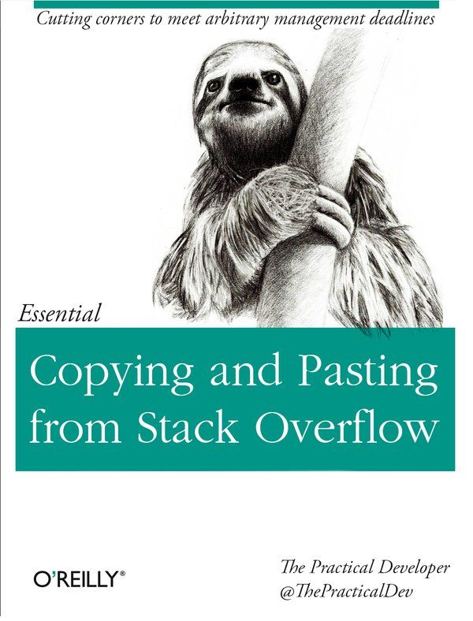

---
#  In this part, we will...

--

### ... learn what are `r gt()`, `r gh()` and `r gl()`;

--

### ... create a first repository that uses `r gt()`;

--

### ... set up a repository in `r gh()` and `r gl()`


 a
---

class: inverse, center, middle

# `r gt()`


##  `r nf()` `r gt()`, `r gh()`, `r gl()`, etc.


---
# Key resources 

.center[]

- `r lk()` S. Chacon & B. Staub (2014), Pro Git https://git-scm.com/book/en/v2
- `r gh()` https://github.com/progit/progit2 
- `r bk()` https://github.com/progit/progit2/releases/tag/2.1.336


---
# Key resources 

.center[]

- `r lk()` J. Bryan (2022), Happy git with R https://happygitwithr.com/

---
# Key resources 

.center[]

- `r lk()` https://tra38.gitbooks.io/essential-copying-and-pasting-from-stack-overflow/content/
- `r so()` https://stackoverflow.com/


---

- https://git.wiki.kernel.org/index.php/GitFaq#Why_the_.27Git.27_name.3F

https://ndpsoftware.com/git-cheatsheet.html#loc=workspace;


---
# `r gt()`


```{bash}
git --version
```


---
# Resources 


## Books

- https://git-scm.com/
- https://happygitwithr.com/ 


## Websites

- https://git.wiki.kernel.org/index.php/Main_Page
- Github: https://docs.github.com/en
- GitLab: https://docs.gitlab.com/ee/topics/git/#git


### cheat sheets

- https://ndpsoftware.com/git-cheatsheet.html#loc=workspace
-https://www.google.com/url?sa=t&rct=j&q=&esrc=s&source=web&cd=&cad=rja&uact=8&ved=2ahUKEwiQ8qeTnaX1AhUFkIkEHdJ3AFoQFnoECAkQAQ&url=https%3A%2F%2Feducation.github.com%2Fgit-cheat-sheet-education.pdf&usg=AOvVaw2D3W2R0fwoOBi8YrhZYLFJ
- https://training.github.com/downloads/github-git-cheat-sheet/
- https://www.freecodecamp.org/news/git-cheat-sheet/


<!-- ---

https://rdatatoolbox.github.io/instructions.html

==> ask what OS do they use 
==> ask if they are confortable with command line tools  
==> ask if they are using Rstudio or other IDE 


==> git grep

# Install git 

les concepts 


## command line or not..

## at first git may not be easy it is a very strong tool but need to understand how it works, not in details but in some depths


Un important changement pour pas mal de developement 

## 

https://desktop.github.com/

https://www.gitkraken.com/


`git version`

`git status -s`


`git init`


`git add`

`git commit`


git + webservice is not a cloud substitue 

avoid large file there are alternative options 


## Build as history


## Work on history

## Manipulate the last commit 


## Branch 


# GitHub

https://github.blog/2021-11-16-the-2021-state-of-the-octoverse/


https://towardsdatascience.com/githubs-path-to-128m-public-repositories-f6f656ab56b1

https://github.blog/2018-11-08-100m-repos/

https://www.upguard.com/blog/bitbucket-vs-github

https://en.wikipedia.org/wiki/Timeline_of_GitHub

https://www.git-tower.com/mac?utm_source=learn-website&utm_campaign=git-faq&utm_medium=easy-in-tower&utm_content=undo-last-commit


https://octoverse.github.com/#lets-look-back-at-the-code-and-communities-built-on-git-hub-this-year

`git checkout`


`git checkout -b`

`git switch -c`

`git switch` (2.23)

## 


### Best practices 

PPP 

PR 


###


## Rewrite the history


`git rebase`


## Adance gh gh cli 


https://happygitwithr.com/ -->


https://github.com/git-guides

<!-- 
."Capitalized, short (50 chars or less) summary

More detailed explanatory text, if necessary.  Wrap it to about 72
characters or so.  In some contexts, the first line is treated as the
subject of an email and the rest of the text as the body.  The blank
line separating the summary from the body is critical (unless you omit
the body entirely); tools like rebase will confuse you if you run the
two together.

Write your commit message in the imperative: "Fix bug" and not "Fixed bug"
or "Fixes bug."  This convention matches up with commit messages generated
by commands like git merge and git revert.

Further paragraphs come after blank lines.

- Bullet points are okay, too

- Typically a hyphen or asterisk is used for the bullet, followed by a
  single space, with blank lines in between, but conventions vary here

- Use a hanging indent"


https://tbaggery.com/2008/04/19/a-note-about-git-commit-messages.html

 As a general rule, your messages should start with a single line that’s no more than about 50 characters and that describes the changeset concisely, followed by a blank lin
  followed by a blank line, followed by a more detailed explanation. 
 

gitmoji
 
could be useful but takes chracters
 
 https://git-send-email.io/#step-1
 
 https://docs.ropensci.org/gert/
 
 https://github.com/r-universe/insileco -->
 
 https://happygitwithr.com/