# Overview

```{r setup_01, include = FALSE}
source("_setup.R")
# knitr::clean_cache(TRUE)
htmltools::tagList(
  xaringanExtra::use_clipboard(
    button_text = "<i class=\"fa fa-clipboard\"></i>",
    success_text = "<i class=\"fa fa-check\" style=\"color: #37abc8\"></i>",
  ),
  rmarkdown::html_dependency_font_awesome()
)
xaringanExtra::use_scribble()
```


---
#  In this part, we will...

--

## learn what are `r gt()`, `r gh()` and `r gl()`;

--

## get a basic understanding of how `r gt()` works.


---
# Key resources

.center[]

- `r lk()` S. Chacon & B. Straub (2014), Pro Git https://git-scm.com/book/en/v2
- `r gh()` https://github.com/progit/progit2
- `r bk()` https://github.com/progit/progit2/releases/tag/2.1.336


---
# Key resources

.center[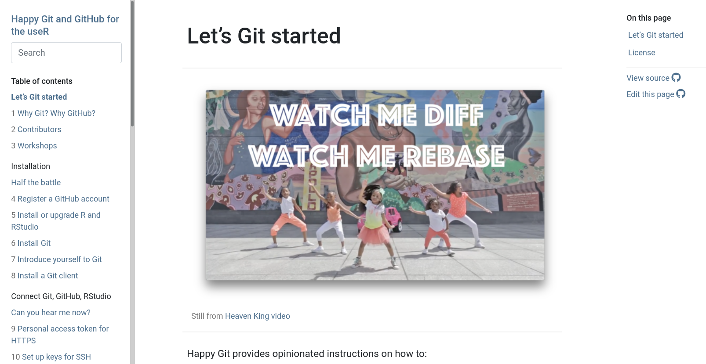]

- `r lk()` J. Bryan (2022), Happy git with R https://happygitwithr.com/

---
# Key resources

.center[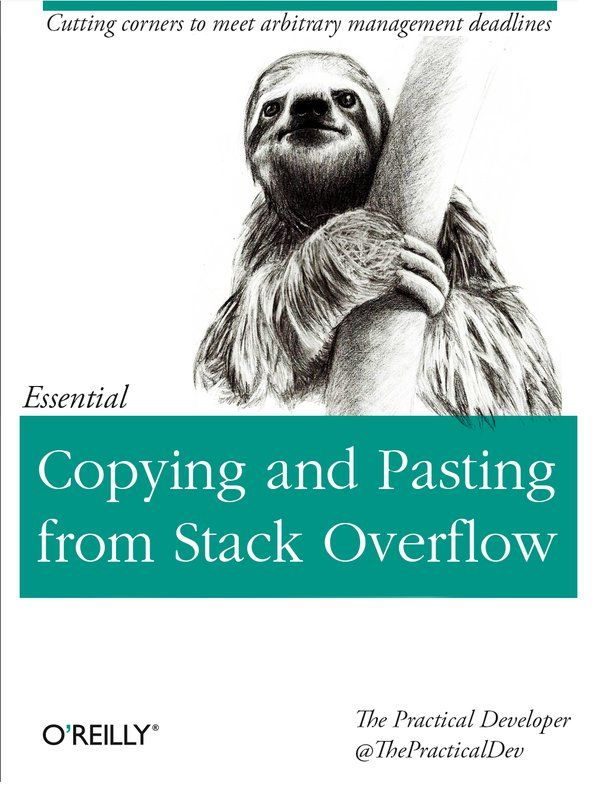]

- `r lk()` https://tra38.gitbooks.io/essential-copying-and-pasting-from-stack-overflow/content/
- `r so()` https://stackoverflow.com/


---

class: inverse, center, middle

# Genesis


## The genesis of `r gt()`


---
# Genesis

### - 2005 Linux Kernel developers needed a new tool to replace [BitKeeper](https://en.wikipedia.org/wiki/BitKeeper)

--

### - Linus Torvald and colleagues start developing a new tool called `r gt()`

--

### - 01/2006 version 1.0
--

### -  2009 `r ar()` [Junio C. Hanamo (@gitster)](https://github.com/gitster) became the lead developer


--

### - 05/2014 version 2.0

--

### - 11/2021 version 2.34


---
# Genesis

.center[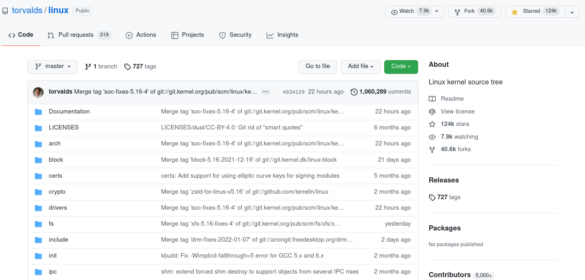]

- `r lk()` https://github.com/torvalds/linux

---
# Genesis

.center[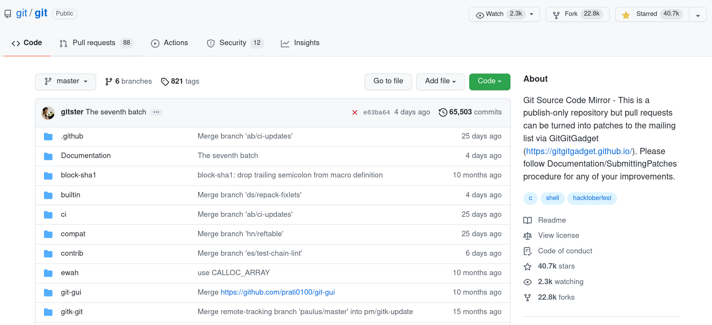]

- `r lk()` https://github.com/git/git


---
# Genesis

### What does `r gt()` actually mean?

.center[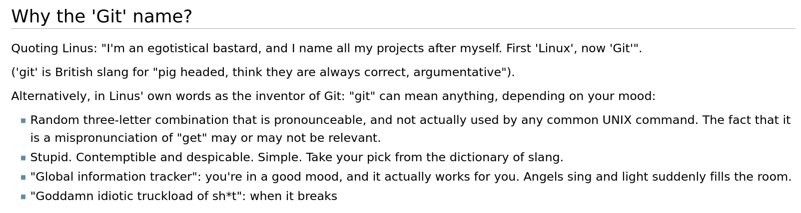]

- `r lk()` https://git.wiki.kernel.org/index.php/Git_FAQ#Why_the_.27Git.27_name.3F


---
# Genesis

### `r gt()` is a version control system

--

### `r gt()` was designed around several goals 

1. Speed
1. Simple design
1. Strong support for non-linear development (thousands of parallel branches)
1. Able to handle large projects like the Linux kernel efficiently (speed and data size) 
1. **Fully distributed**


<br>
- `r lk()` S. Chacon & B. Straub (2014), [Pro Git](https://git-scm.com/book/en/v2)


---

class: inverse, center, middle

# DVCS


## `r gt()` is a distributed version control system

---
# Version Control Systems (VCS)


.center[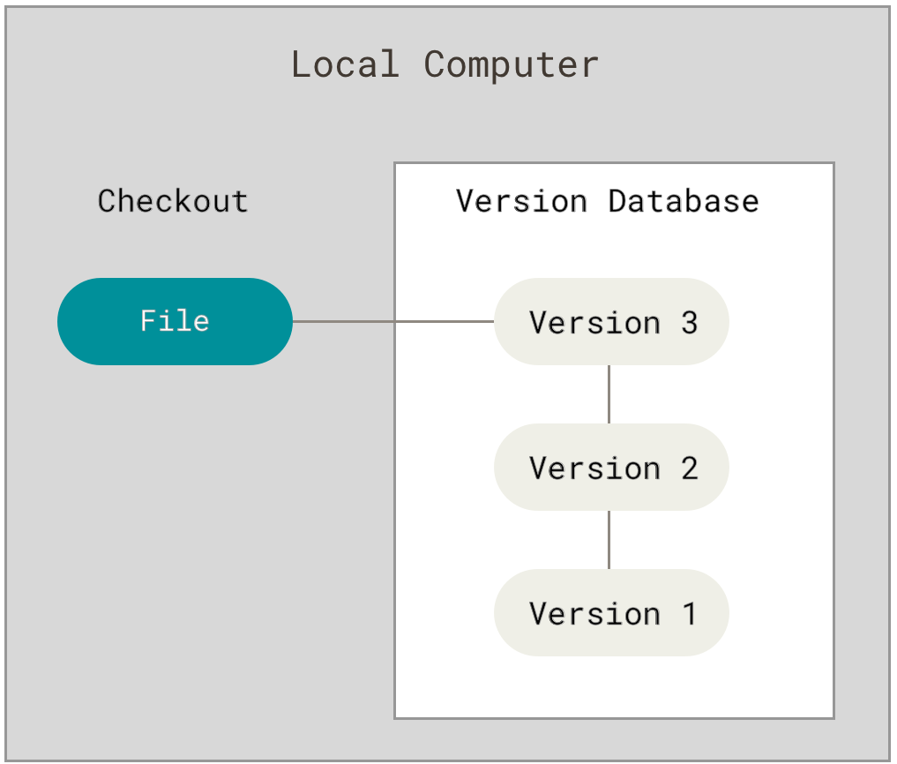]

<br>
- `r lk()` S. Chacon & B. Straub (2014), [Pro Git](https://git-scm.com/book/en/v2).


---
# Centralized Version Control Systems (CVCS)


.center[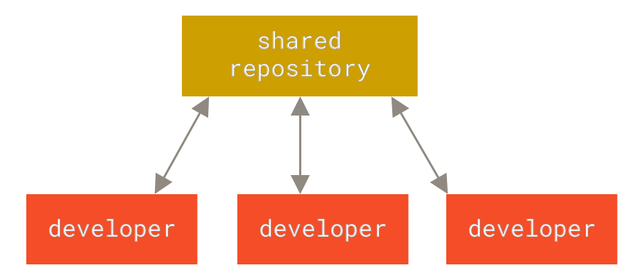]

- `r lk()` S. Chacon & B. Straub (2014), [Pro Git](https://git-scm.com/book/en/v2).

---
# Distributed Version Control Systems (DVCS)


.center[]

- `r lk()` S. Chacon & B. Straub (2014), [Pro Git](https://git-scm.com/book/en/v2).


---
# `r gt()` is fully distributed 

## Every repository includes the entire database 

--

## database = `r emj("file_folder")` `.git` 

--

```sh
$ tree -a -L 1 
.
├── _01_git_github.Rmd
├── _02_basic_git_actions.Rmd
├── _03_beyond_pppp.Rmd
├── _04_rmarkdown.Rmd
├── _05_csas.Rmd
├── DESCRIPTION
├── .git
├── .github
├── .gitignore
```

--

## `.git` is what we share!


---

class: inverse, center, middle

# Snapshots


## `r gt()` stores snapshots of your file system


---
# How does `r gt()` work?

## What does `r emj("file_folder")` `.git` include?

### `.git` stores **snapshots** 

.center[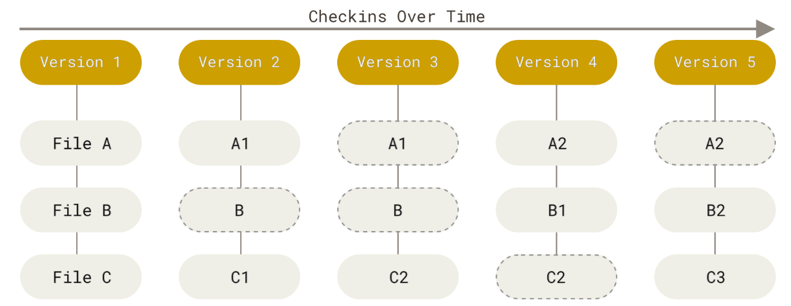]


---
# How does `r gt()` work?

## What does `r emj("file_folder")` `.git`  include?

### `.git` stores **snapshots** not deltas!


.center[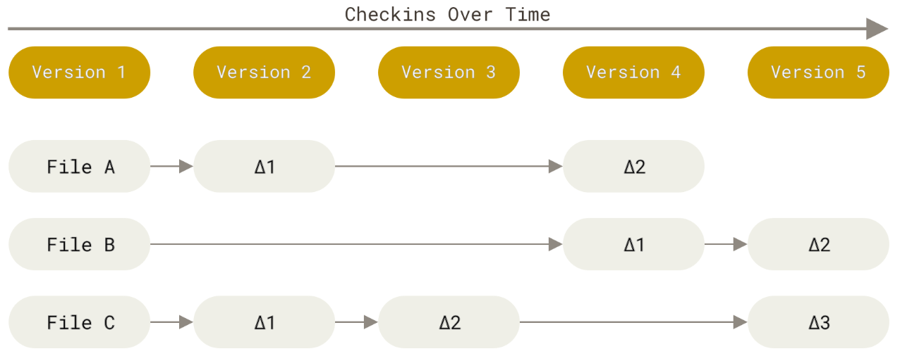]


---
#  **snapshots**?
.center[]

---
#  **snapshots**?

.center[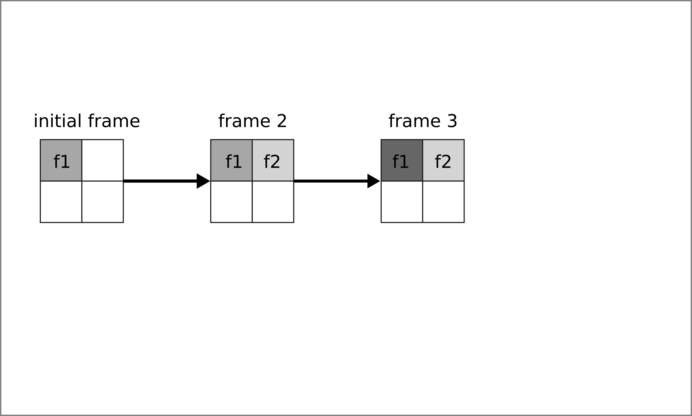]

---
#  **snapshots**?

.center[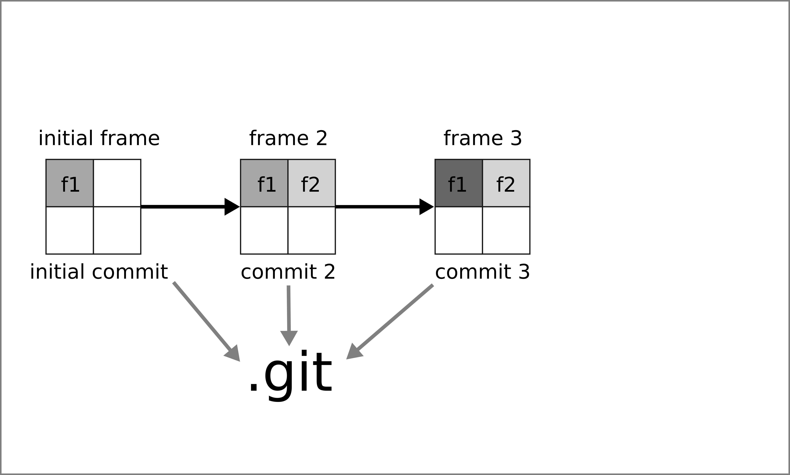]

---
#  **snapshots**?

.center[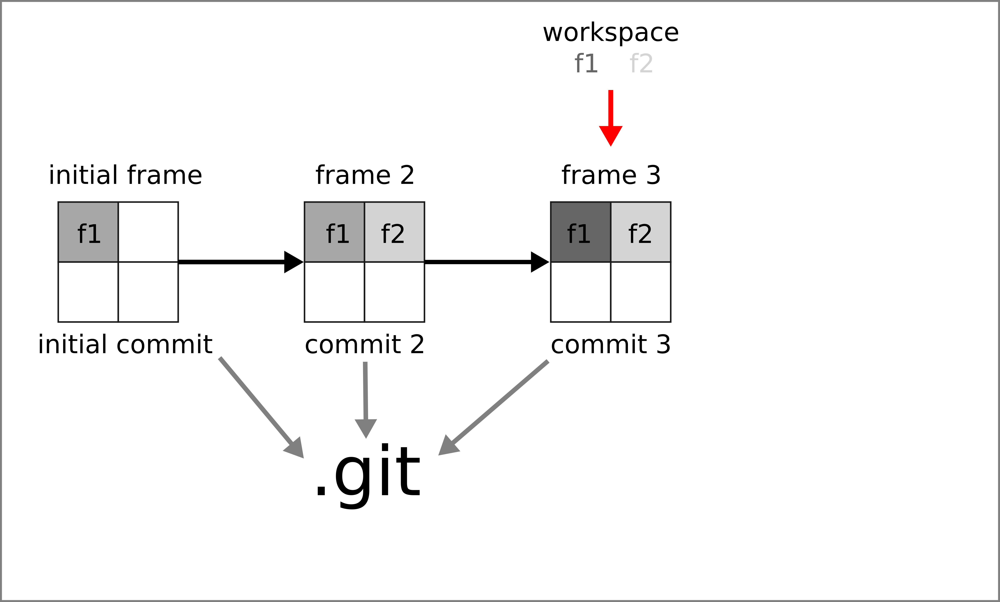]

---
#  **snapshots**?

.center[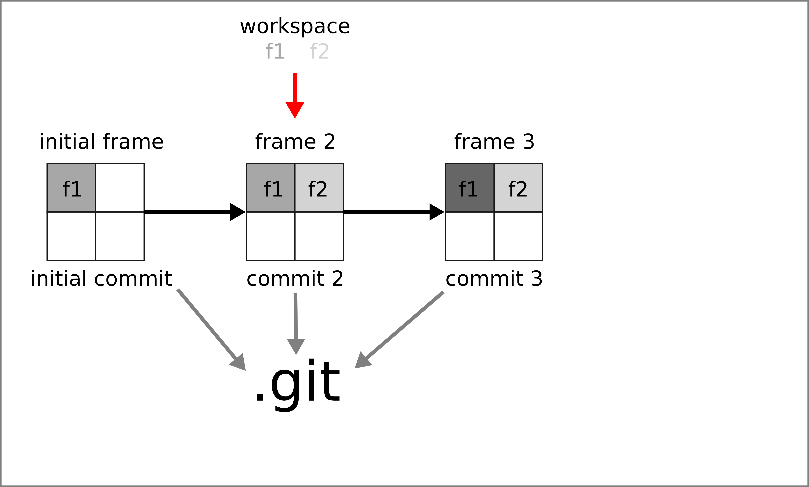]

---
#  **snapshots**?

.center[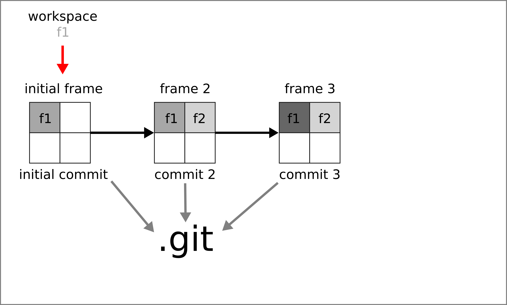]

---
#  **snapshots**?

.center[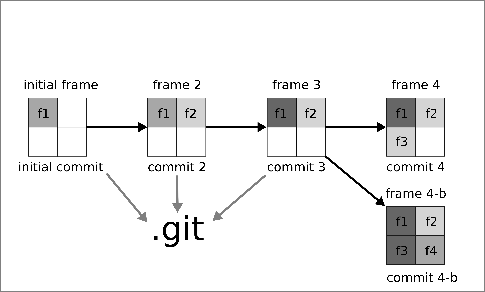]


---
# How do I create snapshots?


### 1. Initiate the repository (`git init`)

--

### 2. Edit your files

--

### 3. Stage the modifications to be committed (`git add`)

--

### 4. Create a new commit object (`git commit`)

--

### 5. Go back to step 2.


---
# How does `r gt()` work?

.center[]

---
# How does `r gt()` work?

.center[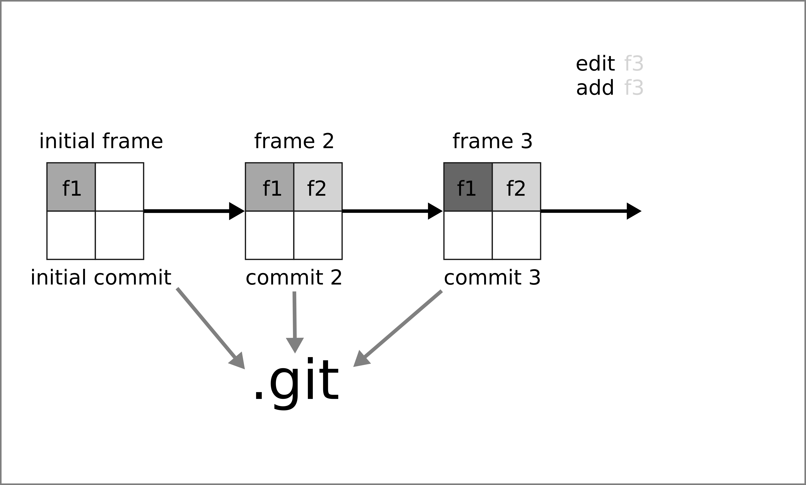]


---
# How does `r gt()` work?

.center[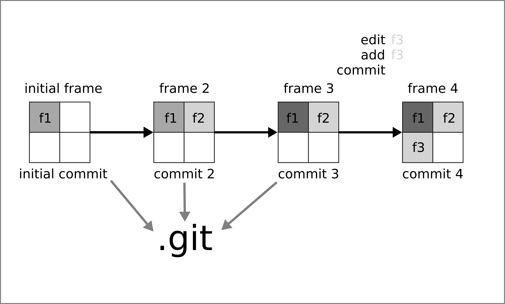]


---

class: inverse, center, middle

# Share your .git database


## `r gh()` & `r gl()`


---
# Setting and using a remote repository

### 1. Go to a server;

--

### 2. Initiate a bare repository (`git init --bare --shared`);

--

### 3. Add the remote to your local repository (`git remote add <name> <adr>`);

--

### 4. Sync your local repository and your remote one (using `git pull` and `git push`).

<br>

- `r lk()` S. Chacon & B. Straub (2014), [Pro Git](https://git-scm.com/book/en/v2/Git-on-the-Server-The-Protocols).


---
# `r gt()` servers


## Your own server

- e.g. a minimal ssh server (see [this post](https://kevcaz.insileco.io/notes/git/git_server_ssh/))

--

## Your own fully-featured server

- [GitLab](https://gitlab.com/)

--

## Dedicated hosting server

- [GitHub](https://github.com/)
- [GitLab](https://gitlab.com/)
- [Bitbucket](https://bitbucket.org/)
- ...

---
# GitHub `r gh()`

> GitHub, Inc. is a provider of Internet hosting for software development and version control using Git. It offers the distributed version control and source code management (SCM) functionality of Git, plus its own features. https://en.wikipedia.org/wiki/GitHub

--

- Git server + database-backed website
- `r rfa("plus")` [Web REST API](https://docs.github.com/en/rest)
- `r rfa("plus")` [Issue tracking system](https://en.wikipedia.org/wiki/Issue_tracking_system)
- `r rfa("plus")` [Project management features](https://github.com/features/issues)
- `r rfa("plus")` Host webpages ([GitHub Pages](https://pages.github.com/))
- `r rfa("plus")` Continuous Integration ([GitHub Actions](https://docs.github.com/en/actions))
- `r rfa("plus")` ...

--

### GitHub in numbers https://octoverse.github.com/


---
# GitLab  `r gl()`


- Git server + database-backed website
- `r rfa("plus")` [Web REST API](https://docs.gitlab.com/ee/api/)
- `r rfa("plus")` Issue tracking system
- `r rfa("plus")` Project management features
- `r rfa("plus")` Host webpages ([GitLab Pages](https://docs.gitlab.com/ee/user/project/pages))
- `r rfa("plus")` Continuous Integration ([Gitlab CI/CD](https://docs.gitlab.com/ee/ci/))
- `r rfa("plus")` ...

--


### GitLab in numbers https://about.gitlab.com/company/

--

### You can install your own `r gl()` server https://about.gitlab.com/install/


---

class: inverse, center, middle

# Use .git!


---
# Install `r gt()`

A lot of tutorials!

- https://git-scm.com/book/en/v2/Getting-Started-Installing-Git

- https://happygitwithr.com/install-git.html

- https://github.com/git-guides/install-git


--

```{bash}
git --version
```


---
# Interact with `r gt()`

### **Command lines**

- **Terminal**
- [RStudio](https://support.rstudio.com/hc/en-us/articles/200532077-Version-Control-with-Git-and-SVN)
- with R, see [`gert`](https://CRAN.R-project.org/package=gert)

--

### More interactively

- [Sourcetree](https://www.sourcetreeapp.com/)
- [GitHub Desktop](https://desktop.github.com/)
- [Git Kraken](https://www.gitkraken.com/)
- Code editors
  - [Visual Studio](https://docs.microsoft.com/en-us/visualstudio/version-control/git-with-visual-studio?view=vs-2022)
  - ...


---
# Get started with GitHub or GitLab


## GitHub `r gh()`

- Sign up on https://github.com, then go to https://docs.github.com/en/get-started

## GitLab `r gl()`

- Go to https://about.gitlab.com/get-started/


---
# `r lc()` demo

### Assuming you have one `r gh()` account and `r gt()` installed;

### We will do it again next week.

<!-- first local then add remote -->

???
terminal install
github open 
Terminal Rstudio open 


---

class: inverse, center, middle

# tl;dr


---
# `r gt()`...

### is a distributed version control system.

--

### stores snapshots of files called commits that are stored in the `.git` folder.

--

### makes collaboration easy by allowing sharing and synchronizing `.git` folder between local and remote repositories.


---
# Resources

### Books

- S. Chacon & B. Straub (2014), [Pro Git](https://git-scm.com/book/en/v2)
- J. Bryan (2022), [Happy git with R](https://happygitwithr.com/)

### Websites

- https://git.wiki.kernel.org/index.php/Main_Page
- https://mirrors.edge.kernel.org/pub/software/scm/git/docs/user-manual.html
- https://learngitbranching.js.org/
- Github: https://docs.github.com/en
- GitLab: https://docs.gitlab.com/ee/topics/git/#git

### Cheat sheets

- https://ndpsoftware.com/git-cheatsheet.html#loc=workspace `r emj("fireworks")`
- https://education.github.com/git-cheat-sheet-education.pdf
- https://www.freecodecamp.org/news/git-cheat-sheet/
