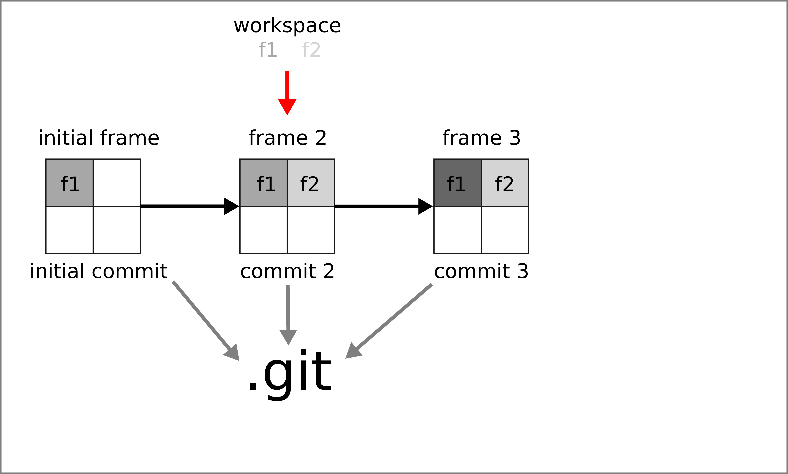

---

# Prerequisite


## `r gt()` installed


```{bash}
git --version
```

--

## Access to a `r gt()` server 

- **`r gh()` account**
- `r gl()` account 


---

class: inverse, center, middle

# Set up your local `r gt()` repository


---
# Start tracking your files

.center[]


---
# Initiate your repository: `git init`

```sh 
$ mkdir proj1
$ cd proj1
$ git init 
Initialized empty Git repository in /path/to/proj1/.git/
```

- `r nf()` [Cygwin](https://www.cygwin.com/)
- `r nf()` [Windows 10 users you can install a bash shell](https://www.howtogeek.com/249966/how-to-install-and-use-the-linux-bash-shell-on-windows-10/)
- Use [R Studio](https://www.rstudio.com/)


???
would be good to ask directly so they can chat about it

---
# Initiate your repository: `git init`

## What has just happened?

### The database `.git` has been created 

```sh
$ tree .git
.git
├── config
├── description
├── HEAD
├── hooks
│   └── README.sample
├── info
│   └── exclude
├── objects
│   ├── info
│   └── pack
└── refs
   ├── heads
   └── tags
```

---
# Inspect your repository: `git status`

## Use `git status` !

--

```sh
$ git status
On branch main

No commits yet

nothing to commit (create/copy files and use "git add" to track)

$ git status -s
  
```

--

- `r nf()` ` git status -s` =  `git status --short`
- `r nf()` `man git status`, `git stauts --help`,  `git status -h`


---
# Basic workflow 

.center[]

- `r lk()` S. Chacon & B. Straub (2014), [Pro Git](https://git-scm.com/book/en/v2).


---
# Edit a file and inspect 

```sh
$ echo "# Our great project" > README.md  
```

```sh
$ git status
On branch main

No commits yet

Untracked files:
  (use "git add <file>..." to include in what will be committed)
	README.md

nothing added to commit but untracked files present (use "git add" to track)

```

--

```sh
$ git status -s
?? README.md
```


---
# Track a file: `git add`

```sh
$ git add README.md
$ git status 
On branch main

No commits yet

Changes to be committed:
  (use "git rm --cached <file>..." to unstage)
	new file:   README.md
```

```sh
$ git status -s
A  README.md
```

---
# What happened? 

- File added to the staging area (a.k.a. "the index") a SHA-1 have been created. 

- no commit yet, `README.md` is not in the `.git` database


---
# Do a second edit and check again

```sh
$ echo "This is a great project" >> README.md  
$ git status  
On branch main

No commits yet

Changes to be committed:
 (use "git rm --cached <file>..." to unstage)
 new file:   README.md

Changes not staged for commit:
 (use "git add <file>..." to update what will be committed)
 (use "git restore <file>..." to discard changes in working directory)
 modified:   README.md

$ git status -s
AM README.md
```


---
# Add all changes and create a first commit 

```sh
$ git status -s
A  README.md
$ git commit -m "add our README"
[main (root-commit) 618b684] add our README
 1 file changed, 2 insertions(+)
 create mode 100644 README.md
$ git status 
On branch main
nothing to commit, working tree clean
```

---
# Initiate, stage a commit with `r rp()`

- Use package [`gert`](https://CRAN.R-project.org/package=gert)

```{R init, eval = FALSE}
dir.create("proj1")
setwd("proj1")
library(gert)
git_init() 
writeLines("# Our great project\n This is a great project", "README.md") 
git_add("README.md")
git_status()
git_commit()
```


---
# Initiate your repository with `r rp()`

## With `gert`

- `git init` `r ar()` `git_init()`
- `git add` `r ar()` `git_status()`
- `git commit` `r ar()` `git_commit()`


## Use `r gt()` from `r rp()`

- `system()` and `system2()` to pass any command


---
# Check the history `git log`


```{bash gitlog}
cd proj1
git log
cd ..
```


---

class: inverse, center, middle

# Set up your local `r gt()` repository


---
# Managing credentials

- https://cran.r-project.org/web/packages/credentials/vignettes/intro.html
- https://usethis.r-lib.org/articles/git-credentials.html
- https://git-scm.com/docs/git-credential-store

- https://phoenixnap.com/kb/generate-ssh-key-windows-10

https://ndpsoftware.com/git-cheatsheet.html#loc=workspace;


https://github.com/github/gitignore


https://nvie.com/posts/a-successful-git-branching-model/

https://danielkummer.github.io/git-flow-cheatsheet/


---
# Using several remotes

```sh
$ git remote -vv
mirror	git@gitlab.com:KevCaz/demogit.git (fetch)
mirror	git@gitlab.com:KevCaz/demogit.git (push)
mirror2	git@raspberrypi.local:/srv/git/demogit.git (fetch)
mirror2	git@raspberrypi.local:/srv/git/demogit.git (push)
origin	git@github.com:inSilecoInc/demogit.git (fetch)
origin	git@github.com:inSilecoInc/demogit.git (push)
```

---
# Will see


```{R rm_proj1, eval = FALSE}
setwd("../")
list.files()
unlink("proj1", recursive = TRUE)
```