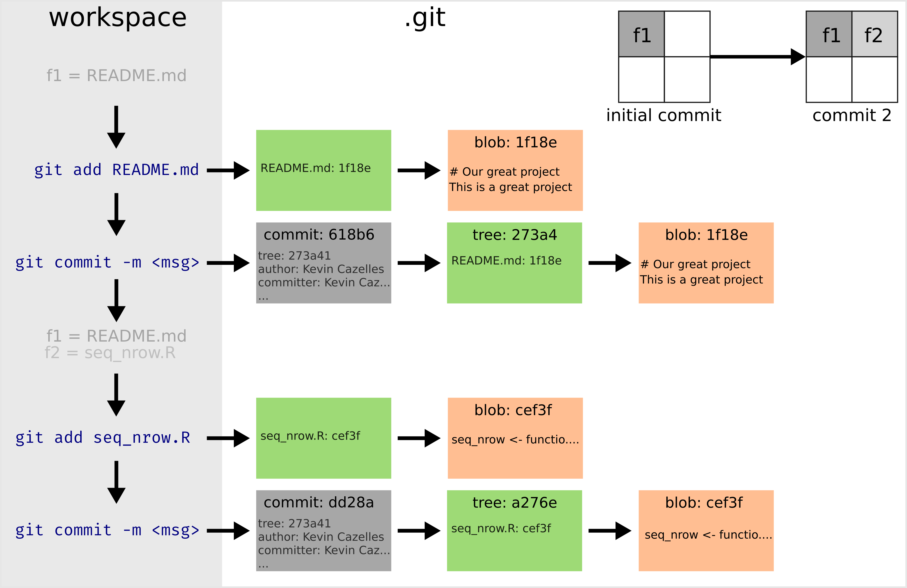
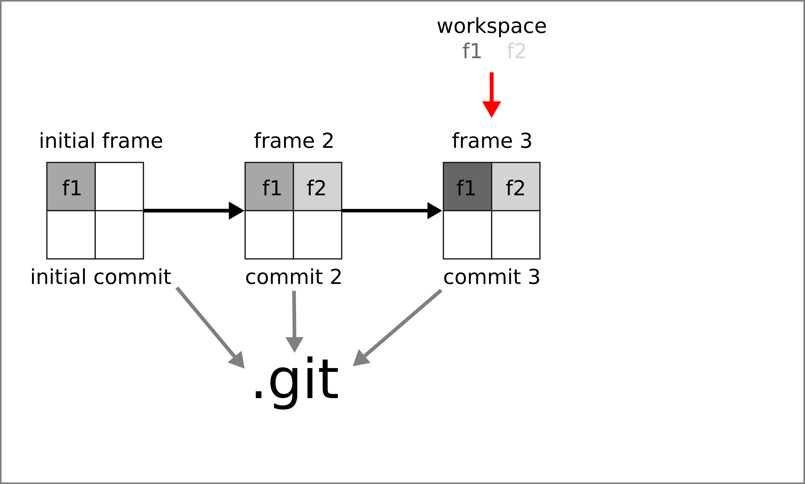

---

# Prerequisite


## `r gt()` installed


```{bash}
git --version
```

--

## Access to a `r gt()` server 

- **`r gh()` account**
- `r gl()` account 


---

class: inverse, center, middle


# Your local `r gt()` repo


## Set your local `r gt()` repository up.


---
# Initiate your repository: `git init`

```sh 
$ mkdir proj1
$ cd proj1
$ git init 
Initialized empty Git repository in /path/to/proj1/.git/
```

--

- `r nf()` [Cygwin](https://www.cygwin.com/)
- `r nf()` [Windows 10 users you can install a bash shell](https://www.howtogeek.com/249966/how-to-install-and-use-the-linux-bash-shell-on-windows-10/)
- Use [R Studio](https://www.rstudio.com/)


---
# Initiate your repository: `git init`

## What has just happened?

### The database `.git` has been created 

```sh
$ tree .git
#> .git
#> ├── config
#> ├── description
#> ├── HEAD
#> ├── hooks
#> │  └── README.sample
#> ├── info
#> │  └── exclude
#> ├── objects
#> │  ├── info
#> │  └── pack
#> └── refs
#>    ├── heads
#>    └── tags
```

---
# Inspect your repository: `git status`

## Use `git status` !

--

```sh
$ git status
#> On branch main

#> No commits yet

#> nothing to commit (create/copy files and use "git add" to track)
```

--

- `r nf()` `man git status`, `git status --help`,  `git status -h`


---

class: inverse, center, middle

# Basic workflow


---
# Basic workflow 

.center[]

- `r lk()` S. Chacon & B. Straub (2014), [Pro Git](https://git-scm.com/book/en/v2).

- https://ndpsoftware.com/git-cheatsheet.html#loc=workspace 


---
# Edit a file and inspect 

```sh
$ echo "# Our great project" > README.md  
```

```sh
$ git status
#> On branch main

#> No commits yet

#> Untracked files:
#>   (use "git add <file>..." to include in what will be committed)
#> 	README.md

#>  nothing added to commit but untracked files present (use "git add" to track)
```

--

```sh
$ git status -s
#> ?? README.md
```

- `r nf()` ` git status -s` =  `git status --short`


---
# Track a file: `git add`

- See https://github.com/git-guides/git-add

```sh
$ git add README.md
```

--

.center[]


## README.md `r ar()` Staging area

--


### README.md `untracked` `r ar()` README.md `staged`

---
# Track a file: `git add`


```sh
$ git status 
#> On branch main
#>
#> No commits yet
#>
#> Changes to be committed:
#>   (use "git rm --cached <file>..." to unstage)
#> 	new file:   README.md
```

--

```sh
$ git status -s
#> A  README.md
```


---
# What happened? 

- `README.md` has been added to the staging area (a.k.a. "the index");

- The file `README.md` is now a *blob* in `.git`;

- To ensure integrity, `r gt()` has computed a [SHA-1](https://en.wikipedia.org/wiki/SHA-1) for it;

--

```sh
git ls-tree -r HEAD
#> 100644 blob 1f18e72276e6dda33cca0065b1f8dd377c72c8c6	README.md
```

---
# How `r gt()` works

.center[]

---
# How `r gt()` works

.center[]

---
# How `r gt()` works

.center[]


---
# Do a second edit and check again

```sh
$ echo "This is a great project" >> README.md  
```

.center[]

--

### 1. In staging area: "+ #Our great project" ready to be committed

### 2. Workspace: README.md is modified "+ This is a great project"


---
# Do a second edit and check again


```sh
$ git status  
#> On branch main
#>
#> No commits yet
#>
#> Changes to be committed:
#>  (use "git rm --cached <file>..." to unstage)
#>  new file:   README.md
#> 
#> Changes not staged for commit:
#>  (use "git add <file>..." to update what will be committed)
#>  (use "git restore <file>..." to discard changes in working directory)
#>  modified:   README.md
```


---
# Create a first commit: `git commit`


```sh
$ git add README.md
```

--

```sh
$ git commit -m "Add our README"
#> [main (root-commit) 618b684] Add our README
#>  1 file changed, 2 insertions(+)
#>  create mode 100644 README.md
```

--

```sh
$ git status 
#> On branch main
#> nothing to commit, working tree clean
```


---
# What happened? 

- `README.md` has been added to the staging area (a.k.a. "the index");

- The file `README.md` as it is, is now a *blob* in `.git`;

- To ensure integrity, `r gt()` has computed a [SHA-1](https://en.wikipedia.org/wiki/SHA-1) for files staged;

- No commits yet, so there is no proper check out/version of the file system. 


---
# How `r gt()` works

.center[]

---
# How `r gt()` works
.center[]

---
# How `r gt()` works

.center[]


---
# Initiate, stage & commit with `r rp()`

- Use package [`gert`](https://CRAN.R-project.org/package=gert)

```{R init, eval = FALSE}
if (!file.exists("proj1")) dir.create("proj1")
dir.create("proj1")
setwd("proj1")
library(gert)
git_init() 
writeLines("# Our great project\n This is a great project", "README.md") 
git_add("README.md")
git_status()
git_commit("Add our README")
```

---
# Initiate your repository with `r rp()`

## With `gert`

- `git init` `r ar()` `git_init()`
- `git add` `r ar()` `git_status()`
- `git commit` `r ar()` `git_commit()`


## Use `r gt()` from `r rp()`

- `system()` and `system2()` to pass any command


---
# One more commit 

```sh
$ echo "seq_nrow <- function(x) seq_len(NROW(x))" > seq_nrow.R
$ git add seq_nrow.R
$ git commit -m "Add seq_nrow()"
#> [main dd28a77] Add seq_nrow()
#>  1 file changed, 1 insertion(+)
#>  create mode 100644 seq_nrow.R
```

???
more than one file at the time.


---
# How `r gt()` works

.center[]

---
# How `r gt()` works

.center[]

---
# How `r gt()` works

.center[]

---
# How `r gt()` works

.center[]

---
# How `r gt()` works

.center[]


---
# How `r gt()` works

.center[]


---
# One more commit 

```sh
$ echo "Cool seq_nrow() function" >> README.md
$ git status -s 
#> M README.md
$ git add README.md
$ git commit -m "Improve the documentation"
#> [main 58d5363] Improve the documentation
#>  1 file changed, 1 insertion(+)
```

???
do this one with commit without -m
and explain that you can use an editor


---
# How to create a good commit?

### Hard to say! 

--

### Some rules of thumb!

- 1 commit = one goal 
- 1 commit = a digestible amount of code (no minimal amount of code)


---
# How to write a good commit message?

--

### It may depend on the project! 

--

### Good habits 

- https://tbaggery.com/2008/04/19/a-note-about-git-commit-messages.html
- https://cbea.ms/git-commit/
  - Separate subject from body with a blank line
  - Limit the subject line to 50 characters
  - Capitalize the subject line
  - Do not end the subject line with a period
  - Use the imperative mood in the subject line
  - Wrap the body at 72 characters
  - Use the body to explain what and why vs. how

- https://gitmoji.dev/

???
may be one more commit with body


---

class: inverse, center, middle

# Navigate your history


log and checkout/switch


---
# Check the history `git log`

## Use `git log`! (see [Pro Git](https://git-scm.com/book/en/v2/Git-Basics-Viewing-the-Commit-History))

```sh
$ git log 
#> commit 8c43aea1ba20ddaccd3c469b7928f532d88275fc (HEAD -> main)
#> Author: Kevin Cazelles <kevin.cazelles@insileco.io>
#> Date:   Tue Jan 18 21:07:36 2022 -0500
#>  
#>     Improve the documentation
#>  
#> commit 7ab0cfb54a54bd732991a4998be0c36d84021452
#> Author: Kevin Cazelles <kevin.cazelles@insileco.io>
#> Date:   Tue Jan 18 21:06:57 2022 -0500
#>  
#>     Add seq_nrow()
#>  
#> commit cbb5a9e2aafb7ad16a8e5dc8f682718946d83292
#> Author: Kevin Cazelles <kevin.cazelles@insileco.io>
#> Date:   Tue Jan 18 21:06:30 2022 -0500
#>  
#>     Add our README
```

???
a lot of options

---
# Check the history `git log`

## `git log` has a lot of options


```sh
$ git log --oneline
#> 8c43aea (HEAD -> main) Improve the documentation
#> 7ab0cfb Add seq_nrow()
#> cbb5a9e Add our README
```
--

```sh
$ git log --pretty=format:"%h - %an, %ar : %s"
#> 8c43aea - Kevin Cazelles, 3 minutes ago : Improve the documentation
#> 7ab0cfb - Kevin Cazelles, 4 minutes ago : Add seq_nrow()
#> cbb5a9e - Kevin Cazelles, 4 minutes ago : Add our README
```

- see [Pro Git](https://git-scm.com/book/en/v2/Git-Basics-Viewing-the-Commit-History)

---
# Navigate your history: `git switch`

```sh
$ git log --oneline
#> 8c43aea (HEAD -> main) Improve the documentation
#> 7ab0cfb Add seq_nrow()
#> cbb5a9e Add our README
```

```sh
$ tree 
#> .
#> ├── README.md
#> └── seq_nrow.R
```

---
# Navigate your history: `git switch`

```sh
$ git checkout cbb5a9e
#> Note: switching to 'cbb5a9e'.
#> 
#> You are in 'detached HEAD' state. You can look around, make experimental
#> changes and commit them, and you can discard any commits you make in this
#> state without impacting any branches by switching back to a branch.
#> 
#> If you want to create a new branch to retain commits you create, you may
#> do so (now or later) by using -c with the switch command. Example:
#> 
#>   git switch -c <new-branch-name>
#> 
#> Or undo this operation with:
#> 
#>   git switch -
#> 
#> Turn off this advice by setting config variable advice.detachedHead to false
#> 
#> HEAD is now at cbb5a9e Add our README
```

---
# Navigate your history: `git switch`


```sh
$ tree 
#> .
#> └── README.md
```

```sh
$ git status
#> HEAD detached at cbb5a9e
#> nothing to commit, working tree clean
```


---
# Navigate your history: `git switch`

```sh
git switch -
```

--

```sh
git switch -d cbb5a9e 
```

### `git checkout` does a lot! v2.23 introduces `git switch` and `git restore` to have aliases of subsets of what it does (see e.g. [this link](https://tanzu.vmware.com/developer/blog/git-switch-and-restore-an-improved-user-experience/))


---
# What happened?

.center[]

---
# What happened?

.center[]


---
# What happened?

- `r gt()` has pulled out the snapshot from the `.git`

- Now the HEAD is now detached: 
  - you can still commit but it won't replace the commits you've done
  - branch will be on a different commit history
  - so far it won't have any impact and won't really be part of your work
  - if want to include it in your "regular" history, you can branch

???
good transition


---
class: inverse, center, middle

# Branching


## `r gt()` killer feature! 


???
Any question so far


---
# Branching

## Branch, branch and branch! 

--

## Use `git branch` a lot!

--

### Branching allows you to create divergent history ...

--

### ... which is exactly what you need for collaboration


---
# Branching

```sh
$ git branch topicA
$ git switch topicA
#> Switched to branch 'topicA'
```

-- 

or in one line 

```sh
$ git switch -c topicA
#> Switched to branch 'topicA'
```

---
# Branching

```sh
$ git status
#> On branch topicA
#> nothing to commit, working tree clean
```

```sh
$ git log --oneline
#> cb1eba0 (HEAD -> topicA, main) Improve the documentation
#> 630c33e Add seq_nrow()
#> 0f2ea9b Add our README
```

---
# A commit on the new branch 

```sh
$ git log --oneline
#> 97832ed (HEAD -> topicA) Add seq_ncol()
#> cb1eba0 (main) Improve the documentation
#> 630c33e Add seq_nrow()
#> 0f2ea9b Add our README
```

---
# What happened?


---
# Merging

```sh
$ git switch main 
$ git merge topicA 
#> Updating 64ee016..aadf541
#> Fast-forward
#>  seq_ncol.R | 1 +
#>  1 file changed, 1 insertion(+)
#>  create mode 100644 seq_ncol.R
```

---
# What happened?

```sh
$ git log --oneline --graph --all
#> * 90e7c57 (HEAD -> topicB) Improve documentation
#> | * 97832ed (topicA, main) Add seq_ncol()
#> | * cb1eba0 Improve the documentation
#> |/  
#> * 630c33e Add seq_nrow()
#> * 0f2ea9b Add our README
```

---
# Merging 

```sh
$ git switch -d HEAD~2
$ git switch -c topicB
$ echo "one more line" >> README.md
$ git add README.md
$ git commit -m "Improve documentation"
$ git switch main
$ git merge topicB
```

---
# Merging 

```sh
$ git merge topicB
Auto-merging README.md
CONFLICT (content): Merge conflict in README.md
Automatic merge failed; fix conflicts and then commit the result.
```

---
# Merging 

while merging

```sh
$ git merge --abort
```

while merging

```sh
$ git merge add README.md
```


```sh
$ git merge -Xours topicB
#> Auto-merging README.md
#> Merge made by the 'ort' strategy.
$ git merge topicB -Xtheirs
```

???
'ort' used to 'recursive' and t is faster and defaut
https://www.spinics.net/lists/git/msg401416.html
"Ostensibly Recursive's Twin"


---
# Merging 

```sh
$ git log --oneline --graph
#> *   d7956c8 (HEAD -> main) Merge branch 'topicB'
#> |\  
#> | * 90e7c57 (topicB) Improve documentation
#> * | 97832ed (topicA) Add seq_ncol()
#> * | cb1eba0 Improve the documentation
#> |/  
#> * 630c33e Add seq_nrow()
#> * 0f2ea9b Add our README
```

---
# Let's rewind

## Careful

```sh
$ git reset --hard HEAD~1
```

### Now we use `git rebase` instead of `git merge`


---
# Rebasing 


```sh
$ git log --oneline --graph
97832ed (HEAD -> topicB, topicA, main) Add seq_ncol()
cb1eba0 Improve the documentation
630c33e Add seq_nrow()
0f2ea9b Add our README
```

```sh
$ git rebase main 
#> Auto-merging README.md
#> CONFLICT (content): Merge conflict in README.md
#> error: could not apply d8b6335... Improve documentation
#> hint: Resolve all conflicts manually, mark them as resolved with
#> hint: "git add/rm <conflicted_files>", then run "git rebase --continue".
#> hint: You can instead skip this commit: run "git rebase --skip".
#> hint: To abort and get back to the state before "git rebase", run "git rebase -- abort".
#> Could not apply d8b6335... Improve documentation
```


---
# Rebasing

```sh
git add README.md 
```

```sh
git rebase --continue
[detached HEAD ad7d26b] Improve documentation
1 file changed, 2 insertions(+)
Successfully rebased and updated refs/heads/topicB
```

---
# Rebasing

```sh
git log --oneline --graph --all
* ad7d26b (HEAD -> topicB) Improve documentation
* 13a0b23 (topicA, main) Add seq_ncol()
* 07bedb8 Improve the documentation
* 851b17b Add seq_nrow()
* 7f65943 Add our README
```

---
# What happened?

### Git act as if change were made after 

### a new commit will be created on top of main

### conflicts will arise is not possible to easily do so


<!-- Questions?? -->

---

class: inverse, center, middle

# Setting up your remote repository


## `r gh()`

??? 
Good buffer, may do it or not! If not just say that it will be good if already set!


---
# Get a GitHub Token 


### Since August 2021 required a personal access token (PAT)

### [Creating a personal access token](https://docs.github.com/en/authentication/keeping-your-account-and-data-secure/creating-a-personal-access-token)

---
# Create a repository 

### [Create a repo](https://docs.github.com/en/get-started/quickstart/create-a-repo)


---
# Add your local repository 


---
# Managing credentials

## Store your PAT

- https://cran.r-project.org/web/packages/credentials/vignettes/intro.html
- https://usethis.r-lib.org/articles/git-credentials.html
- https://git-scm.com/docs/git-credential-store


## Use SSH 

- https://phoenixnap.com/kb/generate-ssh-key-windows-10


- https://ndpsoftware.com/git-cheatsheet.html#loc=workspace;


--- 
# Remote branches


