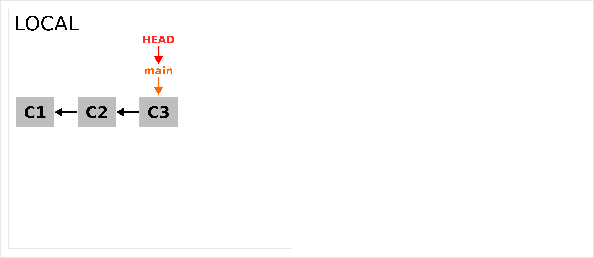
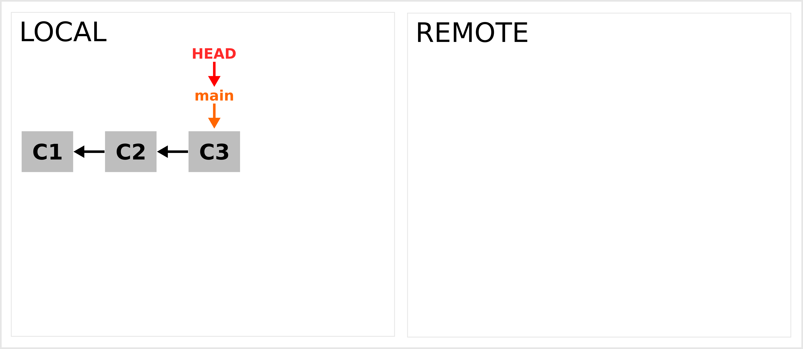
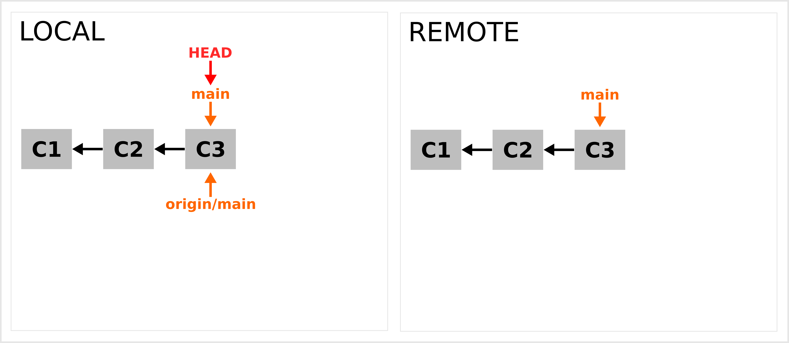
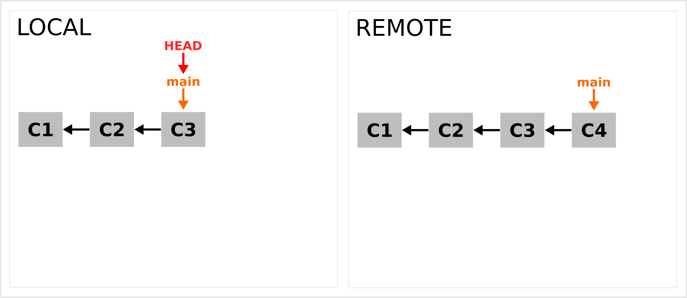
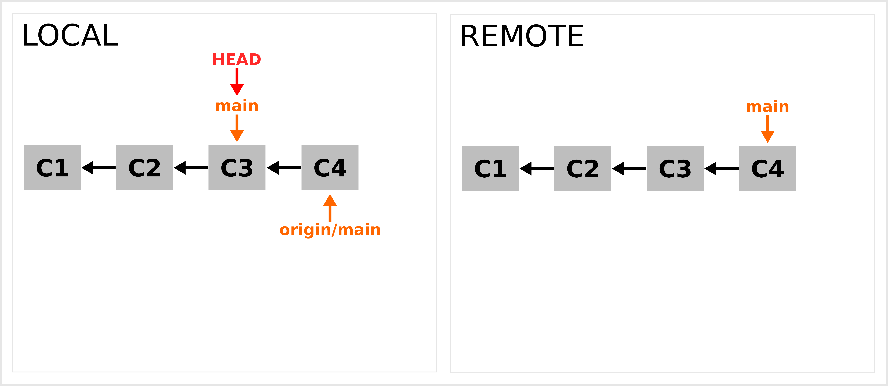
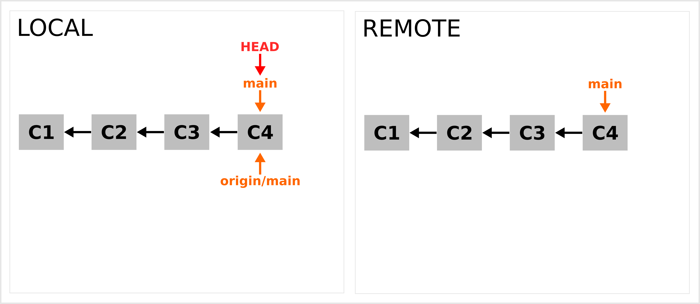
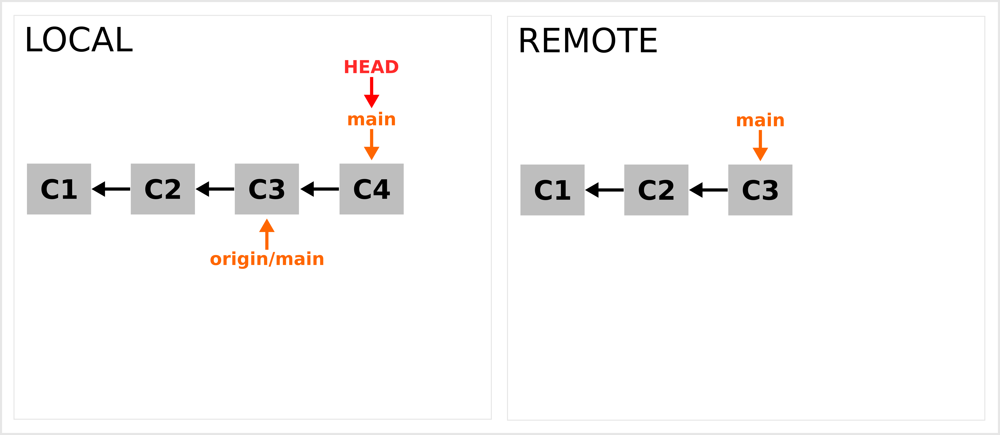
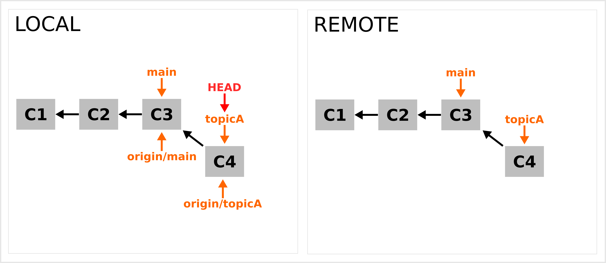

# Local and remote

```{r setup_03, include = FALSE}
source("_setup.R")
# knitr::clean_cache(TRUE)
htmltools::tagList(
  xaringanExtra::use_clipboard(
    button_text = "<i class=\"fa fa-clipboard\"></i>",
    success_text = "<i class=\"fa fa-check\" style=\"color: #37abc8\"></i>",
  ),
  rmarkdown::html_dependency_font_awesome()
)
xaringanExtra::use_scribble()
```


---
# Prerequisite


## `r gt()` installed


```{bash}
git --version
```

--

## Access to a `r gt()` server 

- **`r gh()` account**
- `r gl()` account 


---

class: inverse, center, middle

# Setting up your remote repository


## `r gh()`


---
# Create a repository on `r gh()`

### `r lk()` https://docs.github.com/en/get-started/quickstart/create-a-repo

--

### One entire chapter in [Pro Git](https://git-scm.com/book/en/v2/GitHub-Account-Setup-and-Configuration)

--

## [GitHub CLI](https://cli.github.com/)

```sh
$ gh repo create inSilecoInc/proj1 --public
```

<br>

--

## `r lc()` Let's do this!


---
#2 protocols to access a `r gh()` repo

## Https

- `r nf()` Since August 2021 a [personal access token](https://docs.github.com/en/authentication/keeping-your-account-and-data-secure/creating-a-personal-access-token) (PAT) is required
- https://cran.r-project.org/web/packages/credentials/vignettes/intro.html
- https://usethis.r-lib.org/articles/git-credentials.html
- https://git-scm.com/docs/git-credential-store

--

## SSH (preferred)

- https://phoenixnap.com/kb/generate-ssh-key-windows-10
- https://ndpsoftware.com/git-cheatsheet.html#loc=workspace;
- https://docs.github.com/en/authentication/connecting-to-github-with-ssh/adding-a-new-ssh-key-to-your-github-account


---
# Add remote repo to your local repo

## Https

```sh
$ git remote add origin https://github.com/inSilecoInc/proj1.git
```
--

## SSH

```sh
$ git remote add origin git@github.com:inSilecoInc/proj1.git
```

- Now `r gt()` is aware of the existence of a remote repository 
- NB: a remote repository is just another repo


---
# Inspect the remote repository

```sh
$ git remote show origin
#> * remote origin
#>   Fetch URL: git@github.com:inSilecoInc/proj1.git
#>   Push  URL: git@github.com:inSilecoInc/proj1.git
#>   HEAD branch: (unknown)
```


---
# Set the upstream/main branch

```sh
# make sure you are on main branch
$ git switch main
# first push
$ git push -u origin main
```

- `r nf()` same as `$ git push --set-upstream origin main`

--

### Now your local `main` branch tracks the `origin/main`


---
# Inspect the remote repository

```sh
$ git remote show origin
#> * remote origin
#>   Fetch URL: git@github.com:inSilecoInc/proj1.git
#>   Push  URL: git@github.com:inSilecoInc/proj1.git
#>   HEAD branch: main
#>   Remote branch:
#>     main tracked
#>   Local branch configured for 'git pull':
#>     main merges with remote main
#>   Local ref configured for 'git push':
#>     main pushes to main (up to date)
```

---
# Inspect the remote repository

```sh
$ git branch
#> * main
#>  topicA
#>  topicB
```

--

```sh
$ git branch -a
#> * main
#>   topicA
#>   topicB
#>   remotes/origin/main
```

### `r nf()` Having a local repo and a remote repo is simply about tracking more branches.


---
# Inspect the remote repository


```sh
$ git branch -v
#> * main   f878ca9 Add seq_ncol()
#>   topicA 13a0b23 Add seq_ncol()
#>   topicB ad7d26b Improve documentation
```

--

```sh
git branch -vv
#> * main   f878ca9 [origin/main] Add seq_ncol()
#>   topicA 13a0b23 Add seq_ncol()
#>   topicB ad7d26b Improve documentation
```

--

```sh
$ git log --oneline
#> f878ca9 (HEAD -> main, origin/main) Add seq_ncol()
#> 07bedb8 Improve the documentation
#> 851b17b Add seq_nrow()
#> 7f65943 Add our README
```
???
You cannot move the HEAD to a remote branch


---
# How `r gt()` works

.center[]

---
# How `r gt()` works

.center[]

---
# How `r gt()` works - 1st push

.center[]


---
# `r lc()` Let's do this

## Add a remote.


---
# `r lc()` Let's do this

## Clone and fork


### 1. **Clone** 

```sh
$ git clone git@github.com:inSilecoInc/demogit.git
#> Cloning into 'demogit'...
#> remote: Enumerating objects: 3, done.
#> remote: Counting objects: 100% (3/3), done.
#> remote: Total 3 (delta 0), reused 3 (delta 0), pack-reused 0
#> Receiving objects: 100% (3/3), done.
```

- `git clone` get a copy of the remote repo (`git`);
- set up a local branch to track the default remote branch. 

--

### 2. **Fork**

- Copy a `r gh()` repository on one of your `r gh()` account.

`r tr()` More on this [next session](_04_rmarkdown.html)!

???
delete add re-initiate proj1 with a readme and a .gitignore for clone
then do a fork and then a clone


---
# Using several remotes

### `r nf()` I set up 3 remotes for one of our repo 

https://github.com/inSilecoInc/demogit

```sh
$ git remote -vv
#> mirror	git@gitlab.com:KevCaz/demogit.git (fetch)
#> mirror	git@gitlab.com:KevCaz/demogit.git (push)
#> mirror2	git@raspberrypi.local:/srv/git/demogit.git (fetch)
#> mirror2	git@raspberrypi.local:/srv/git/demogit.git (push)
#> origin	git@github.com:inSilecoInc/demogit.git (fetch)
#> origin	git@github.com:inSilecoInc/demogit.git (push)
```


---

class: inverse, center, middle

# Fetch, pull & push


---
# Fetch, pull & push

> git-fetch - Download objects and refs from another repository

> git-pull - Fetch from and integrate with another repository or a local
       branch

> git-push - Update remote refs along with associated objects


---
# Fetch

### Download missing refs and objects

```sh
$ git fetch
```

--

```sh
$ git fetch origin
```

--

```sh
$ git fetch --all
```


---
# Pull 


```sh
$ git pull
#> [...]
```

--


## Fetch + merge

--

```sh
$ git fetch
#> [...]
$ git merge origin/main
#> [...]
```


---
# How `r gt()` works

.center[]

---
# How `r gt()` works

.center[]

---
# How `r gt()` works

.center[]


---
# Push 


```sh
$ git push
#> [...]
```

--

--

```sh
$ git push <option> <repo> <branch>
#> [...]
```

--

```sh
$ git push origin -d topicA
#> [...]
```

- to delete a remote branch


---
# How `r gt()` works

.center[]

---
# How `r gt()` works

.center[]


---

class: inverse, center, middle

# Remote branches


## `r gh()`


---
# Add a new branch to the remote


```sh
$ git switch -c topicC
[...]
```

--

```sh
$ git push
#> fatal: The current branch topicC has no upstream branch.
#> To push the current branch and set the remote as upstream, use
#> 
#>    git push --set-upstream origin topicC
```

--

```sh
$ git push -u origin topicC
#> Total 0 (delta 0), reused 0 (delta 0), pack-reused 0
#> To raspberrypi.local:/srv/git/coolio.git
#>  * [new branch]      topicC -> topicC
#> Branch 'topicC' set up to track remote branch 'topicC' from 'origin'.
```

---
# How `r gt()` works

.center[]

---
# How `r gt()` works

.center[]

---
# Track a remote branch  


```sh
$ git checkout --track origin/topicA 
```

--

```sh
$ git switch -t topicA
#> Branch 'topicA' set up to track remote branch 'topicA' from 'origin'.
#> Switched to a new branch 'topicA'
```

--

```sh
$ git switch topicA
#> Branch 'topicA' set up to track remote branch 'topicA' from 'origin'.
#> Switched to a new branch 'topicA'
```

???
and with -c it can be renamed.

---
# Cheat sheet

- `r lk()` https://ndpsoftware.com/git-cheatsheet.html#loc=workspace


---

class: inverse, center, middle

# Advanced features


---
# Collaborative workflows

- `r lk()` https://nvie.com/posts/a-successful-git-branching-model/
- `r lk()` https://danielkummer.github.io/git-flow-cheatsheet/


---
# Configuration: `git config`

- `r lk()` https://git-scm.com/book/en/v2/Customizing-Git-Git-Configuration


```sh
$ git config --global user.email "kevin.cazelles@gmail.com"
```
--


```sh
$ git config --global user.name "Kevin Cazelles"
```

--

```sh
$ git config --local core.editor emacs
```

--

- `r lk()` https://git-scm.com/book/en/v2/Git-Basics-Git-Aliases

```sh
$ git config --global alias.co checkout
```
- then `git co` = `git checkout`
- shell aliased


---
# Some commands you might use at some point

- `git tag`: create tags
- `git diff`: check difference between commits (and more)
- `git show`: inspect a commit 
- `git rebase -i`: rewrite history interactively
- `git reset`: undo commits
- `git filter-branch`: remove stuff from history (see [`git-filter-repo`](https://github.com/newren/git-filter-repo))
