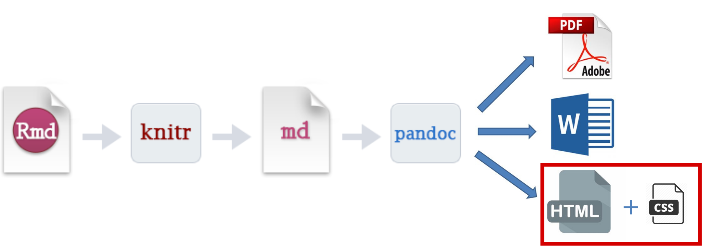

<!-- rmarkdown::render("_04_rmarkdown.Rmd") -->

```{r setup_04, include = FALSE}
source("_setup.R")
# knitr::clean_cache(TRUE)
htmltools::tagList(
  xaringanExtra::use_clipboard(
    button_text = "<i class=\"fa fa-clipboard\"></i>",
    success_text = "<i class=\"fa fa-check\" style=\"color: #37abc8\"></i>",
  ),
  rmarkdown::html_dependency_font_awesome()
)
xaringanExtra::use_scribble()
```

# Accessing and modifying `r gh()` repositories


---
# Prerequisites: `r gt()` & `r gh()`


## `r gt()` installed


```{bash}
git --version
```

--

## Access to a GitHub `r gh()` account 

- Sign up on https://github.com, then go to https://docs.github.com/en/get-started

---
# Prerequisites: pandoc & </img>

##  Pandoc

```{bash, eval=FALSE}
pandoc --version
#> pandoc 2.11.4
```

.font80[`r nf()` Installed with `r rp()` Studio, otherwise go [here](https://pandoc.org/installing.html) for installation info]


--

##  rmarkdown </img> installed

```{r eval=FALSE}
# Install from CRAN
install.packages('rmarkdown')
```

---
class: inverse, center, middle

# Accessing and modifying repositories


## `r gh()`


---
#  How to access repositories on `r gh()`

.pull-left[
## `git fork`

Copy any public repository to your `r gh()` account or organization without making changes to the upstream repository

.font80[`r nf()` Issues, branches, pull requests and other `r gh()` features will not be copied]
]

.pull-right[
## `git clone` 
]

---
#  How to access repositories on `r gh()`

.pull-left[
## `git fork`

Copy any public repository to your `r gh()` account or organization without making changes to the upstream repository

.font80[`r nf()` Issues, branches, pull requests and other `r gh()` features will not be copied]
]

.pull-right[
## `git clone` 

Create a local copy of a `r gh()` remote repo from:
 
- your account
- another user
- `r gh()` organizations

]

---
#  Committing changes to a `r gh()` repository

.pull-left[
## `git fork`

- Fork repo 
- Make changes 
- Submit a *Pull request* .font80[(next session)]
]

.pull-right[
## `git clone` 
]

---
#  Committing changes to a `r gh()` repository

.pull-left[
## `git fork`

- Fork repo 
- Make changes 
- Submit a *Pull request* .font80[(next session)]
]

.pull-right[
## `git clone` 

- Clone repo 
- Make changes 
- Push / merge changes

.font80[`r nf()` Consider using *Pull requests* when collaborating on a repo (next session)]

.font80[`r nf()` must be a collaborator or organization member to push commits to a repo you do not own]
]


---
#  Should I clone or should I fork?


.pull-left[
## `git fork`

- Begin a project from an existing public `r gh()` repo 
- Propose changes to someone else's project
- Continue a project without affecting the upstream repo
]

.pull-right[
## `git clone` 
]

---
#  Should I clone or should I fork?


.pull-left[
## `git fork`

- Begin a project from an existing public `r gh()` repo 
- Propose changes to someone else's project
- Continue a project without affecting the upstream repo
]

.pull-right[
## `git clone` 

- Get a local copy of your `r gh()` repo 
- Actively collaborate on a projects

.font80[`r tr()` Cloning is still required if forking a `r gh()` repo]
]

--

.font80[`r nf()` See [here](https://www.geeksforgeeks.org/difference-between-fork-and-clone-in-github/) and [here](https://www.theserverside.com/answer/Git-fork-vs-clone-Whats-the-difference) for more on the difference between forking and cloning]

---
# Forking vs cloning: what's happening?

<center></img></center>

---
# Forking vs cloning: what's happening?

<center></img></center>


---
# Forking

- Go to the `r gh()` repo you wish to fork and click on `Fork` .font70[(top-right)]

<center></img></center>

--

- Navigate to your profile to get the newly forked repo's URL

<center></img></center>

--

- Clone the forked `r gh()` repository using your preferred protocol .font70[(coming up!)]

---
# Cloning 

```sh
$ git clone <repo>
```

---
# Adding collaborators 

- Navigate to your `r gh()` settings 
- Go to `Collaborators`
- Click on `Add people` to invite collaborators

<center></img></center>
 

---
# `r lc()` Let's do this

## Fork a repository

## Clone a repository 

## Add a collaborator

---
class: inverse, center, middle

# Markdown


## .font200[`r rfa("markdown")`]


---

# `r rfa("markdown")` Markdown

## Reproducibility workshop  [`r gh()`](https://github.com/inSilecoInc/workshop_reproducibility)

### March 2021


---

# `r rfa("markdown")` Markdown

## Dynamic documents

- Creating dynamic documents to automate workflows
  - Code & text living together

--

## Markup language

- Rendering text using tags to format document
  - LaTex, HTML `r rfa("html5")`, Markdown `r rfa("markdown")`
  - Forget word! `r rfa("ban")` `r rfa("file-word")` .font60[as much as allowed by collaborators]

--

## Computing language

- Code for analyses and figures
  - `r rfa("r-project")`, Python `r rfa("python")`, Julia, Matlab, C++, ...
  - Forget excel! `r rfa("ban")` `r rfa("file-excel")` .font60[as much as humanly possible]

---

# `r rfa("markdown")` Markdown

## The genesis

HTML markup is complex:

```html
<!DOCTYPE html>
<html>
    <body>
        <h1>Section header</h1>
        <p>Paragraph</p>
    </body>
</html>
```

---

# `r rfa("markdown")` Markdown

## The genesis

In comes markdown, a lightweight markup language:

  > Markdown is a text-to-HTML conversion tool for web writers. Markdown allows you to write using an easy-to-read, easy-to-write plain text format, then convert it to structurally valid XHTML (or HTML).

  > The overriding design goal for Markdown’s formatting syntax is to make it as readable as possible. .font90[[John Gruber, 2004](https://daringfireball.net/projects/markdown/)]

---

# `r rfa("markdown")` Markdown

## The genesis

.pull-left[
From this:

```html
<!DOCTYPE html>
<html>
    <body>
        <h1>Section header</h1>
        <p>Paragraphe</p>
    </body>
</html>
```
]


.pull-right[
To this:
```md
# Section header

Paragraph
```
]

---

# `r rfa("markdown")` Markdown

## Variants

- Original developers (John Gruber and Aaron Swartz, a.k.a. [The Internet's Own Boy](https://www.imdb.com/title/tt3268458/)) did not continue developing Markdown after its release in 2004

--

- Avid enthusiasts took care of that. The results: many variants.
  - [GitHub Flavored Markdown (GFM)](https://docs.github.com/en/github/writing-on-github)
  - [Kramdown](https://kramdown.gettalong.org/)
  - [Markdown Extra](https://michelf.ca/projects/php-markdown/extra/)
  - [Multi Markdow](https://github.com/fletcher/MultiMarkdown/wiki/MultiMarkdown-Syntax-Guide#math-support)
  - [Pandoc's Markdown](https://pandoc.org/MANUAL.html)

--

- [CommonMark](https://commonmark.org/) is addressing standardizing issues with Markdown.

---

# `r rfa("markdown")` Markdown

## Pandoc's Markdown

**Why?**

  - `r rfa("r-project")` uses it through [R Markdown](https://rmarkdown.rstudio.com/lesson-8.html) 

--

**What is Pandoc?**

> a universal document converter

> `r rfa("markdown")` `r rfa("arrow-right")` <i>LaTeX</i> `r rfa("arrow-right")` `r rfa("file-pdf")`
<br/>
> `r rfa("markdown")` `r rfa("arrow-right")` `r rfa("file-word")`
<br/>
> `r rfa("html5")` `r rfa("arrow-right")` `r rfa("markdown")`
<br/>
> **...**

.fon80[See [Pandoc's website](https://pandoc.org/index.html) for a list of all possible conversions]


---

class: inverse, center, middle

# .font200[`r rfa("r-project")`]


</img>
</img>


---

# </img> knitr

[`knitr`](https://cran.r-project.org/package=knitr) .font90[01/2012 (0.1) &nbsp; // &nbsp; 01/2021 (1.3.1)]

> Elegant, flexible, and fast dynamic report generation with R .font80[([Yihui Xie, creator](https://yihui.org/knitr/))]

--

- `knitr` executes code embedded in a dynamic document and "knits" it back into the document.

---

# </img> R Markdown

[`rmarkdown`](https://cran.r-project.org/package=rmarkdown) .font90[09/2014 (0.3.3) &nbsp; // &nbsp; 02/2021 (2.7)]

> Convert R Markdown documents into a variety of formats.

<center></img></center>


---

class: inverse, center, middle

# </img> Basic anatomy


## .font160[**YAML** + `r rfa("markdown")` + `r rfa("r-project")`]

---

# </img> Basic anatomy

## R Markdown file

.pull-left[
- A `r rfa("markdown")` file written with (`r rfa("r-project")`) has the extension `.Rmd` (capital optional)

- Structured in three parts:
  - .font80[**YAML**]: Metadata / front matter
  - `r rfa("markdown")`: Text / document content
  - `r rfa("r-project")`: Code chunks .font70[(optional)]
]

.pull-right[
</img>
]

---

# </img> Basic anatomy

## Exporting .font80[*a.k.a.* knitting 🧶]

.pull-left[
- `knitr` executes the code and converts `.Rmd` to `.md`
- Pandoc renders the `.md` file to the output format you want.
]

.pull-right[
</img>
]


---

# </img> Basic anatomy

## Exporting .font80[*a.k.a.* knitting 🧶]

### `rmarkdown::render()`

- Use [`render()`](https://www.rdocumentation.org/packages/rmarkdown/versions/2.6/topics/render) from the [`rmarkdown`](https://cran.r-project.org/package=rmarkdown) package
- Generates the desired output from the `.Rmd` file

--

Main arguments:

```md
input: name of file to render
output_format: one or more output formats, as specified in the YAML header.
               "all" exports all the specified formats (optional).
output_file: name of output file (optional).
```

--

Minimal example:

```{r, eval = FALSE}
rmarkdown::render(input = "myrmd.Rmd")
```


---

class: inverse, center, middle

# Metadata


## .font160[**YAML**]

---

# .font60[**YAML**] Metadata

- Contains the metadata of the document
- Starts and ends with three hyphens (---)
- Comes first in the `.Rmd` file
- Sets *Pandoc* document options with `key: value` (.font60[**YAML**] syntax)
- Available options depend on the output format .font90[(see `?html_document `, `?pdf_document`, `?word_document`)]

--

<br/>

Minimal .font60[**YAML**] metadata for `r rfa("file-pdf")` PDF output:

```yaml
---
output: pdf_document
---
```

---

# .font60[**YAML**] Metadata

## Document information

Title, author and date options

```yaml
---
title: "My document title"
date: "01-03-2021"
author: Me, you, them
output: pdf_document
---
```

---

# .font60[**YAML**] Metadata

## Document options: additional options

- There is a wide variety of [.font60[**YAML**] options](https://rstudio.com/wp-content/uploads/2016/03/rmarkdown-cheatsheet-2.0.pdf) available

.font90[
```yaml
---
title: "My document title"
date: "01-03-2021"
author: Me, you, them
abstract: "The objective of our work was to ..."
fontfamily: fourier
linestretch: 1
fontsize: 10pt
geometry: margin=1in
urlcolor: red
citecolor: blue
output:
  pdf_document:
    toc: true
  html_document:
    toc: true
  word_document:
    toc: true
---
```
]


---

class: inverse, center, middle

# Text


## .font160[`r rfa("markdown")`]

---

# `r rfa("markdown")` Text formatting


.pull-left[
.font80[
```md
Normal text
```
]
]

.pull-right[
.font80[Normal text]
]

--

.pull-left[
.font80[
```md
_Italic_ *text*
```
]
]

.pull-right[
.font80[_Italic_ *text*]
]

--

.pull-left[
.font80[
```md
__Bold__ **text**
```
]
]

.pull-right[
.font80[__Bold__ **text**]
]

--

.pull-left[
.font80[
```md
***Bold italic*** **_text_**
```
]
]

.pull-right[
.font80[***Bold italic*** **_text_**]
]

--

.pull-left[
.font80[
```md
~~Strikethrough text~~
```
]
]

.pull-right[
.font80[~~Strikethrough text~~]
]


---

# `r rfa("markdown")` Document formatting

## Titles

.pull-left[
.font80[
```md
# Header 1
## Header 2
### Header 3
#### Header 4
##### Header 5
###### Header 6
```
]
]

.pull-right[
.font80[
# Header 1
## Header 2
### Header 3
#### Header 4
##### Header 5
###### Header 6
]
]

---

class: inverse, center, middle

#  `r rfa("code")` Code chunks

<html><div style='float:left'></div><hr color='#ffdd55'style="margin-top: -60px;" size=1px width=720px></html>

## The `r rfa("r-project")`  part

---

# `r rfa("code")` Code chunks

````md
This text is written in markdown

```{r}`r ''`
library(tibble)
data(iris)
head(iris)
```
````

- `r rfa("exclamation-triangle")` `r` between brackets `{}`, why is that?
- Where is the `r rfa("r-project")` code and the `r rfa("markdown")` section?


---

# `r rfa("code")` Code chunks

### Code

```{r, eval = FALSE}
library(tibble)
data(iris)
head(iris)
```

### Print output

```{r echo = FALSE, eval = TRUE}
library(tibble)
data(iris)
head(iris)
```


---

# `r rfa("code")` Code chunks
.pull-left[

### Code

```{r, eval = FALSE}
library(ggplot2)
data(iris)
ggplot(
      data=iris,
      aes(x = Sepal.Length,
          y = Sepal.Width)
  ) +
geom_point(
  aes(color=Species, shape=Species)
) +
xlab("Sepal Length") +
ylab("Sepal Width") +
ggtitle("Sepal Length-Width")
```
]

.pull-right[
### Graphic output

```{r echo = FALSE, eval = TRUE, dpi=300, fig.height=5, fig.width=5}
library(ggplot2)
data(iris)
ggplot(
      data=iris,
      aes(x = Sepal.Length,
          y = Sepal.Width)
  ) +
  geom_point(aes(color=Species, shape=Species)) +
  xlab("Sepal Length") +  ylab("Sepal Width") +
  ggtitle("Sepal Length-Width")
```
]

---

# `r rfa("code")` Inline code chunks

### `r rfa("code")` Syntax

We studied `` `r
length(levels(iris$Species))` `` iris species and took
measurements on `` `r
nrow(iris)` `` flowers.

We found that Iris virginica had the longest sepal with a mean of
`` `r
mean(subset(iris,Species=="virginica")$Sepal.Length)`
`` millimeters!

### `r rfa("file-alt")` Output

````md
This text is written in markdown.

We studied `r length(levels(iris$Species))` iris species and took measurements on `r nrow(iris)` flowers.

We found that Iris virginica had the longest sepal with a mean of `r mean(iris$Sepal.Length[iris$Species=="virginica"])` millimeters!
````

---

class: inverse, center, middle

# `r rfa("rocket")` Chunk options

<html><div style='float:left'></div><hr color='#ffdd55' style="margin-top: -60px;" size=1px width=720px></html>

---

# `r rfa("code")` Code chunk options


.pull-left[
- Place between curly braces
  `{r option=value}`

- Multiple options separated by commas
  `{r option1=value, option2=value}`

- Label your code chunk!
</img>

]


.pull-right[

.font90[
````md
```{r dispIris, option1=value, option2=value}`r ''`
library(tibble)
data(iris)
head(iris)
```
````
]
]


---

# `r rfa("code")` Code chunk options

## What output each option suppresses?

Option             | Run code | Show code | Output | Plots | Messages | Warnings
-------------------|:--------:|:---------:|:------:|:-----:|:--------:|:-------:
`eval = FALSE`     |`r rfa("times")`|         |`r rfa("times")`|`r rfa("times")`|`r rfa("times")`|`r rfa("times")`
`include = FALSE`  | |`r rfa("times")`|`r rfa("times")`|`r rfa("times")`|`r rfa("times")`|`r rfa("times")`
`echo = FALSE`     |  |`r rfa("times")`|     |    |      |
`results = "hide"` |        |        |`r rfa("times")`|     |        |
`fig.show = "hide"`|        |       |     | `r rfa("times")`|      |
`message = FALSE`  |          |           |        |       |`r rfa("times")`|
`warning = FALSE`  |          |           |        |       |          |`r rfa("times")`

Table from [R for Data Science](https://r4ds.had.co.nz/r-markdown.html#chunk-options)

---

# `r rfa("book")` The `down` universe

- [`bookdown`](https://bookdown.org/): Write a notebook
- [`csasdown`](https://github.com/pbs-assess/csasdown): Write a CSAS document .font60[(next session)]
- [`thesisdown`](https://github.com/ismayc/thesisdown): Write a thesis
- [`rticles`](https://github.com/rstudio/rticles): Write a scientific article
- [`posterdown`](https://github.com/brentthorne/posterdown): Create a poster
- [`xaringan`](https://github.com/yihui/xaringan): Create nice presentation .font60[(like this one)]
- [`vitae`](https://github.com/mitchelloharawild/vitae): Build a CV
- [`blogdown`](https://bookdown.org/yihui/blogdown/): Generate a blog
- [`pkgdown`](https://pkgdown.r-lib.org/): Generate R package documentation

--

***Other resources:***

- [R Markdown book](https://bookdown.org/yihui/rmarkdown/)
- [knitr documentation](https://yihui.org/knitr/)
- [inSileco web book (fr)](https://kevcaz.insileco.io/Rmarkdowndocfr/)
- [inSileco reproducibility workshop](https://www.insileco.io/workshop_reproducibility/#89)

---
# `r lc()` Let's do this

## Create a simple `rmd` document in our repo

## Create html document

```{r echo=FALSE, out.width="100%"}

```


---
class: inverse, center, middle

# GitHub Pages

<html><div style='float:left'></div><hr color='#ffdd55' style="margin-top: -60px;" size=1px width=720px></html>

## Transform your `r gh()` repo into a website

---
# GitHub Pages

GitHub provides a free web hosting services called [GitHub Pages](https://docs.github.com/en/pages) that allows you to turn your `r gh()` repo into websites

> GitHub Pages is a static site hosting service that takes HTML, CSS, and JavaScript files straight from a repository on GitHub, optionally runs the files through a build process, and publishes a website. 

---
# GitHub Pages

There are [multiple advantages](https://medium.com/@cheukting.ho/newbie-tips-5-advantage-of-using-github-pages-for-hosting-35bee4c1ce14) to use GitHub Pages for developpers

- Free 
- Version control
- Custom domain 
- Supports HTTPS

--

In our case, it also makes it easy to share and disseminate our research and our work through: 

- [Blogs](https://blog.insileco.io/)
- [Websites](https://www.insileco.io/)
- [Books & reports](https://kevcaz.insileco.io/Rmarkdowndocfr/)
- [Presentations](https://www.insileco.io/learning_git/)

---
# GitHub Pages 

## How to create github page from repository

1. Open a new GitHub repository and activate GitHub pages
2. Link this new repo to a RStudio project
3. Add a `.Rmd` document and generate the HTML document (we know that part!)
4. Declare (`add`) and document (`commit`) the modifications on the repository
5. Send these modifications with the HTML output on GitHub via RStudio


---
# GitHub Pages 

## How to create github page from repository

1. Open a new GitHub repository and ***activate GitHub pages***
2. Link this new repo to a RStudio project
3. Add a `.Rmd` document and generate the HTML document (we know that part!)
4. Declare (`add`) and document (`commit`) the modifications on the repository
5. Send these modifications with the HTML output on GitHub via RStudio

--

`r tr()` exported html must be named `index.html`


---
# GitHub Pages 

## Activating GitHub Pages

- Navigate to your `r gh()` settings 
- Go to `Pages` 
- Select `main` branch as source

<center></img></center>


---

# GitHub Pages

## Activating GitHub Pages

### Congratulations!

<center></img></center>

--
... now be patient & wait few minutes to see the results

```{r echo=FALSE, out.width="35%", fig.align = 'center'}
knitr::include_graphics("img/part4/ironcat.jpeg")
```

---
# `r lc()` Let's do this

## Transform our repo into a website

```{r echo=FALSE, out.width="100%"}
knitr::include_graphics("img/part4/rmarkdownflow_html_github.png")
```


---
# Additional ressources 

*This was a brief intro to GitHub Pages and the possibilities it offers*

***For more:***

- [GitHub Pages documentation page](https://docs.github.com/en/pages)
- [Jekyll](https://jekyllrb.com/)
  - [Jekyll & GitHub Pages](https://docs.github.com/en/pages/setting-up-a-github-pages-site-with-jekyll)
  - Example: [`r gh()`](https://github.com/jekyll/example) [`r rfa("globe-americas")`](http://jekyll.github.io/example/)
- [Hugo](https://gohugo.io/)
  - [GitHub Pages & Hugo](https://gohugo.io/hosting-and-deployment/hosting-on-github/)
  - Example: [`r gh()`](https://github.com/inSilecoInc/inSilecoInc.github.io) [`r rfa("globe-americas")`](https://www/insileco.io/)


