<!-- rmarkdown::render("_05_csas.Rmd") -->

```{r setup_05, include = FALSE}
source("_setup.R")
# knitr::clean_cache(TRUE)
htmltools::tagList(
  xaringanExtra::use_clipboard(
    button_text = "<i class=\"fa fa-clipboard\"></i>",
    success_text = "<i class=\"fa fa-check\" style=\"color: #37abc8\"></i>",
  ),
  rmarkdown::html_dependency_font_awesome()
)
xaringanExtra::use_scribble()
```

# Working collaboratively with GitHub `r gh()`


---
# Prerequisites


## `r gt()` installed


```{bash}
git --version
```

--

## Access to a GitHub `r gh()` account 

- Sign up on https://github.com, then go to https://docs.github.com/en/get-started

---
# Prerequisites

##  Pandoc

.font90[
```{bash, eval=FALSE}
pandoc --version
#> pandoc 2.11.4
```
]

.font80[`r nf()` Installed with `r rp()` Studio, otherwise go [here](https://pandoc.org/installing.html) for installation info]


--

## </img> rmarkdown installed

.font90[
```{r eval=FALSE}
# Install from CRAN
install.packages('rmarkdown')
```
]

--

## </img> TinyTex 

.font90[
```{r eval = FALSE}
install.packages("tinytex")
tinytex::install_tinytex()
```
]

# Working collaboratively with GitHub `r gh()`


---

class: inverse, center, middle

# Creating CSAS reports: csasdown


[</img>](https://github.com/pbs-assess/csasdown)


---
# `r bk()` The `down` universe

- [`bookdown`](https://bookdown.org/): Write a notebook
- ***[`csasdown`](https://github.com/pbs-assess/csasdown): Write a CSAS document***
- [`thesisdown`](https://github.com/ismayc/thesisdown): Write a thesis
- [`rticles`](https://github.com/rstudio/rticles): Write a scientific article
- [`posterdown`](https://github.com/brentthorne/posterdown): Create a poster
- [`xaringan`](https://github.com/yihui/xaringan): Create nice presentation (e.g. this presentation)
- [`vitae`](https://github.com/mitchelloharawild/vitae): Build a CV
- [`blogdown`](https://bookdown.org/yihui/blogdown/): Generate a blog
- [`pkgdown`](https://pkgdown.r-lib.org/): Generate R package documentation

---
# [</img>](https://github.com/pbs-assess/csasdown) csasdown


`csasdown` .font90[v.0.0.10.9000] 
[`r gh()`](https://github.com/pbs-assess/csasdown) 
[`r rfa("desktop")`](https://www.dropbox.com/s/7m23mh3yfhk5ah8/csasdown-slides.pdf?dl=1)

```{r echo=FALSE, out.width="100%"}
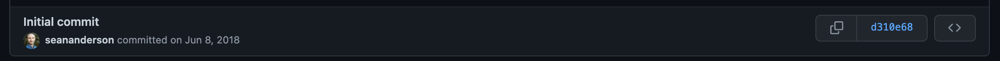
```

Developed by Sean Anderson 
[`r rfa("envelope")`](mailto:sean.anderson@dfo-mpo.gc.ca) 
[`r rfa("globe-americas")`](https://seananderson.ca/) 

> Reproducible CSAS Reports with R Markdown

--

> csasdown is an R package that facilitates generating Canadian Science Advisory Secretariat (CSAS) documents in PDF or Word format using R Markdown and bookdown.

--

> csasdown gratefully builds on the work of many others including bookdown, thesisdown, and csas-style by Yihui Xie, Chester Ismay, Nick Solomon, Ben Marwick, Chris Grandin, Andrew Edwards, Matthew Grinnel


---
# [</img>](https://github.com/pbs-assess/csasdown) csasdown

## Install the package 

```{r eval = FALSE}
install.packages("remotes")
remotes::install_github("pbs-assess/csasdown")
```

---
# [</img>](https://github.com/pbs-assess/csasdown) csasdown

## Create a draft

There are 3 types of documents available 

- Research Document: `csasdown::draft("resdoc")`
- Technical Report: `csasdown::draft("techreport")`
- Science Response: `csasdown::draft("sr")`

--

.font90[`r nf()` By default, the draft files are added in the current root folder. You can use the argument `create_dir = TRUE` for the draft to be created in a folder entitled `index/`]

--

.font90[`r nf()` Each draft contains valuable information included by the authors. Create the drafts and consult the documents!]


--

```{r eval = FALSE}
csasdown::draft("techreport")
```

---
# [</img>](https://github.com/pbs-assess/csasdown) csasdown

## Create a draft

.pull-left[
```{r echo=FALSE, out.width="50%"}
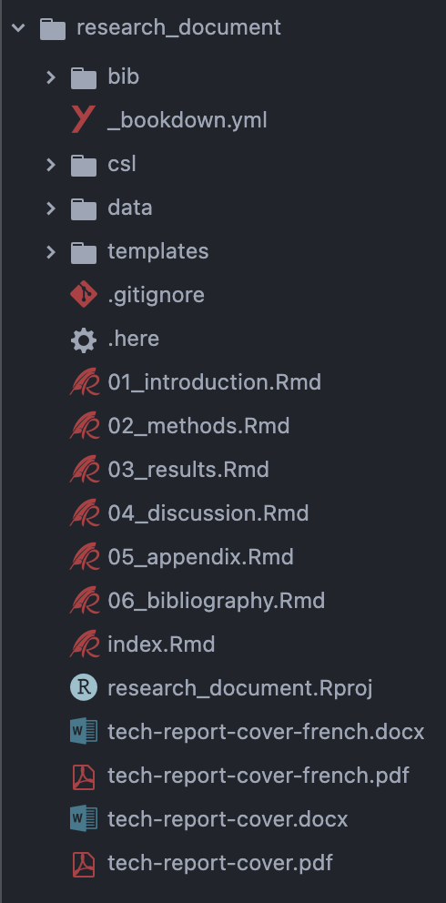
```
]

.pull-right[
- Structure of the resulting document
]

---
# [</img>](https://github.com/pbs-assess/csasdown) csasdown

## `index.Rmd`

```{r echo=FALSE, out.width="90%"}
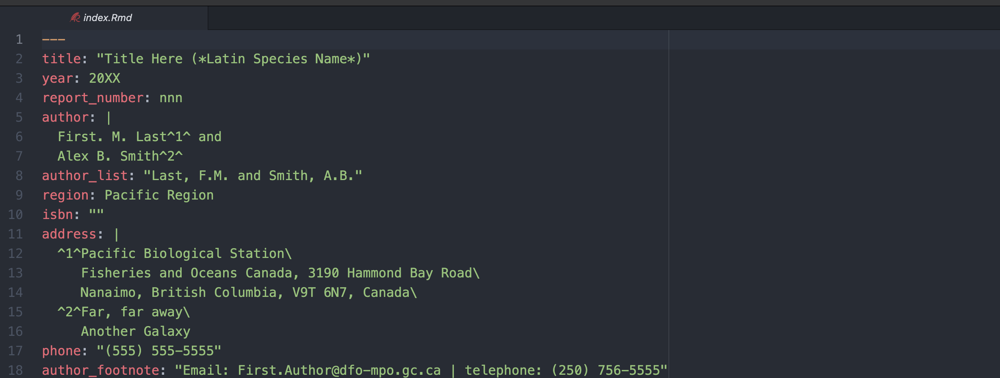
```

- Main document for the report 
- Edit authors, title, abstract, affiliations, etc

---
# [</img>](https://github.com/pbs-assess/csasdown) csasdown

## Chapters

```{r echo=FALSE, out.width="90%"}
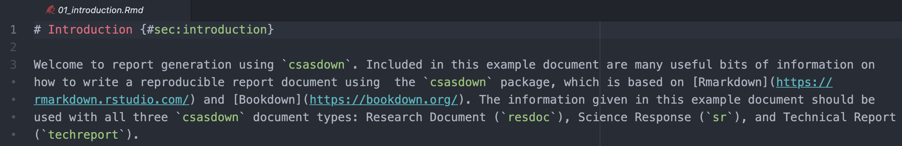
```

- One document, or partial document, per chapter
- Begin chapter with main title formatting `# Title`
- Add text, figures, tables, etc

.font80[`r tr()` You do not have to follow this logic, as long as the documents are well referenced in `_bookdown.yml` (next slide)]


---
# [</img>](https://github.com/pbs-assess/csasdown) csasdown

## `bookdown.yml`

```{r echo=FALSE, out.width="90%"}
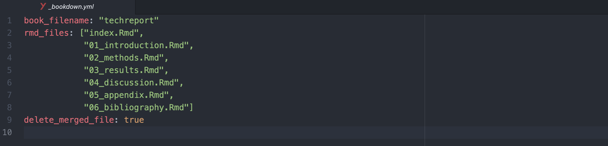
```

- Specifies which partial documents and the order in which the documents are included in the final report

---
# [</img>](https://github.com/pbs-assess/csasdown) csasdown

## Render the CSAS document 

```{r eval = FALSE}
bookdown::render_book("index.Rmd")
```

---
# `r lc()` Let's do this


---

class: inverse, center, middle

# Collaborating on CSAS reports


## .font400[`r gh()`] [</img>](https://github.com/pbs-assess/csasdown)


---
# Working collaboratively with GitHub

##  Collaborative development models 

.pull-left[
***Shared repository model***

- Collaborators are granted direct access to a single shared repo
- Create branches for development
- Merge changes to main branch
- Small teams and organizations collaborating on private projects
]


---
# Working collaboratively with GitHub

##  Collaborative development models 

.pull-left[
***Shared repository model***

- Collaborators are granted direct access to a single shared repo
- Create branches for development
- Merge changes to main branch
- Small teams and organizations collaborating on private projects
]

.pull-right[
***Fork and pull model***

- Fork repo and push changes to your own repo 
- No permission required
- Changes pulled to upstream repo through pull requests 
- Favoured by open source projects for independent development
]

---
# Working collaboratively with GitHub

##  Collaborative development models 

.pull-left[
***Shared repository model***

- Collaborators are granted direct access to a single shared repo
- Create branches for development
- Merge changes to main branch
- Small teams and organizations collaborating on private projects
]

.pull-right[
***Fork and pull model***

- Fork repo and push changes to your own repo 
- No permission required
- Changes pulled to upstream repo through pull requests 
- Favoured by open source projects for independent development
]

.pull-left[
`r nf()` ***pull requests*** are recommended
]

.pull-right[
`r nf()` ***pull requests*** are mandatory
]

---
# Pull requests 

## What are they?

> Pull requests let you tell others about changes you've pushed to a branch in a repository on GitHub. Once a pull request is opened, you can discuss and review the potential changes with collaborators and add follow-up commits before your changes are merged into the base branch. 


.font80[`r nf()` Go [Here](https://co-learning.eu/2017/10/04/why-and-how-do-we-use-pull-request/) for all you need to know on pull requests on `r gh()`]

---
# Pull requests 

## Why use them?

- Code review
- Test and validate code 
- Find errors or improvement opportunities 
- Education / training of other developers
- Allow less experienced coder to contribute without worrying they will mess up the main project

.font80[`r nf()` [Here](https://co-learning.eu/2017/10/04/why-and-how-do-we-use-pull-request/) is a nice blog post on the benefits of using pull requests for co-development]

---
# Pull requests 

## What is the process of creating one?

.pull-left[
***Shared repository model*** 

- Create a branch
- Make, commit and push changes to branch
- Create pull request 
- Assign pull request
- Review process 
- Merge branch to base branch
]

---
# Pull requests 

## What is the process of creating one?

.pull-left[
***Shared repository model*** 

- Create a branch
- Make, commit and push changes to branch
- Create pull request 
- Assign pull request
- Review process 
- Merge branch to base branch
]

.pull-right[
***Fork and pull model*** 

- Fork a repository
- Make, commit and push changes to fork
- Create pull request 
- Assign pull request
- Review process 
- Merge fork to upstream repo
]

---
# Pull requests 

## What is the process of creating one?

.pull-left[
***Shared repository model*** 

- Create a branch
- Make, commit and push changes to branch
- **Create pull request**
- **Assign pull request**
- **Review process**
- Merge branch to base branch
]

.pull-right[
***Fork and pull model*** 

- Fork a repository
- Make, commit and push changes to fork
- **Create pull request**
- **Assign pull request**
- **Review process**
- Merge fork to upstream repo
]


---
# Pull requests 

## Creating pull requests

- Navigate to repo on `r gh()`
- Click on *Pull request*

```{r echo=FALSE, out.width="90%"}
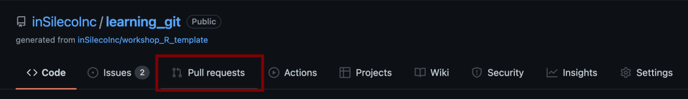
```

---
# Pull requests 

## Creating pull requests

- Click on *New pull request*

```{r echo=FALSE, out.width="90%"}
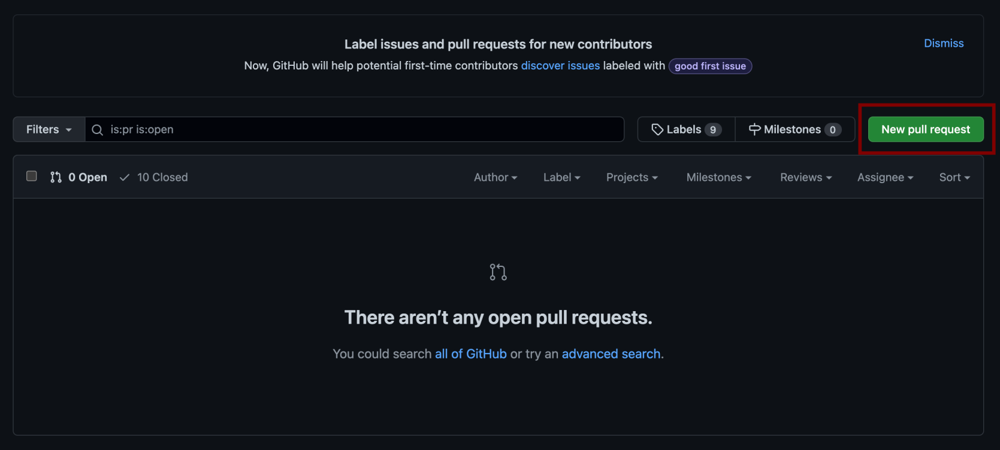
```

---
# Pull requests 

## Creating pull requests

***From a branch:***

.pull-left[
- Select branches to merge
  - `base`: merge into
  - `compare`: merge from
]

```{r echo=FALSE, out.width="90%"}
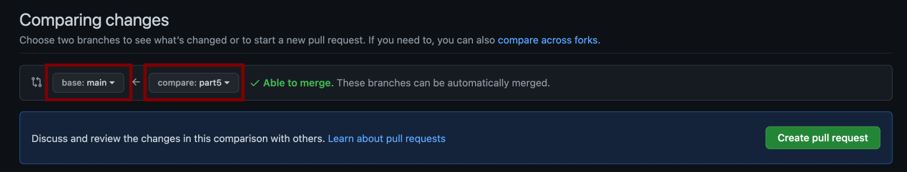
```

---
# Pull requests 

## Creating pull requests

***From a Fork:***

.pull-left[
- Select repos to merge
  - `base repository`: upstream repo
  - `head repository`: forked repo
]

.pull-right[
- Select branches to merge
  - `base`: merge into
  - `compare`: merge from
]


```{r echo=FALSE, out.width="90%"}
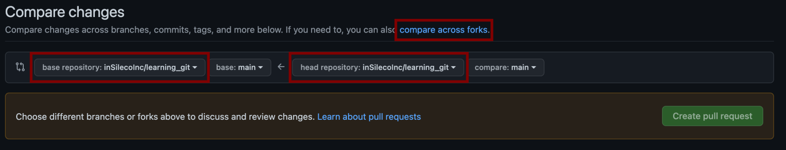
```


---
# Pull requests 

## Creating pull requests

- Click on *Create pull request*

```{r echo=FALSE, out.width="90%"}
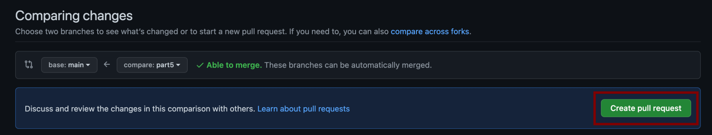
```

---
# Pull requests 

## Creating pull requests

- Write your pull request description

```{r echo=FALSE, out.width="67%"}
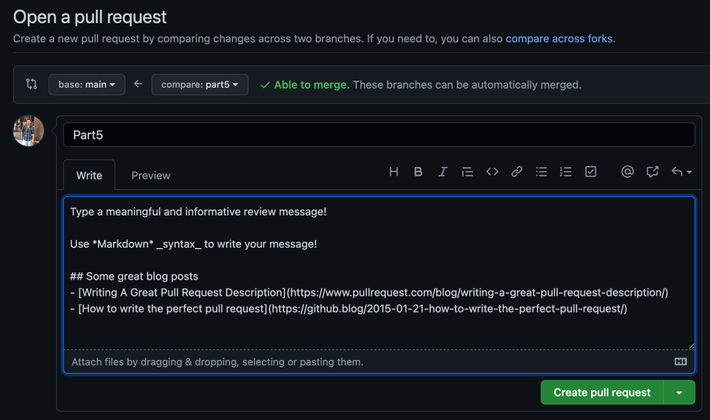
```

- .font80[`r nf()` [Writing A Great Pull Request Description](https://www.pullrequest.com/blog/writing-a-great-pull-request-description/)]
- .font80[`r nf()` [How to write the perfect pull request](https://github.blog/2015-01-21-how-to-write-the-perfect-pull-request/)]

---
# Pull requests 

## Creating pull requests

- Click on *Create pull request* 

```{r echo=FALSE, out.width="67%"}
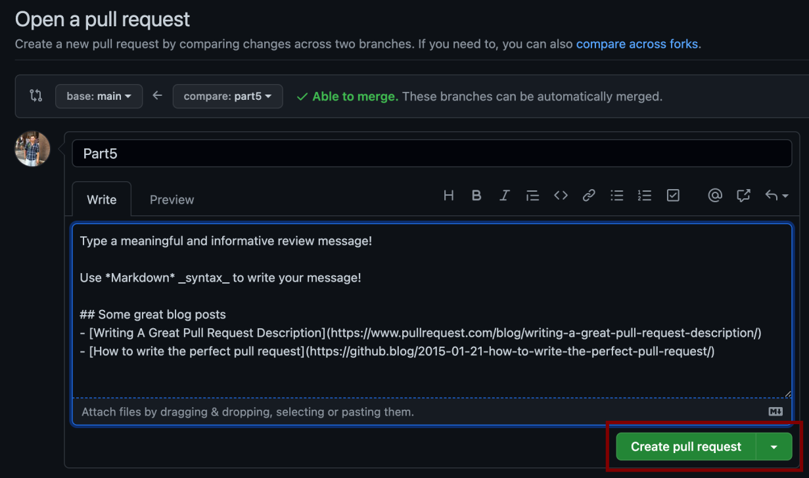
```

---
# Pull requests 

## Creating pull requests

And you're done! 

```{r echo=FALSE, out.width="100%"}
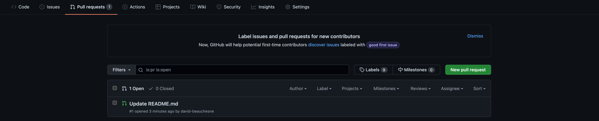
```

---
# Pull requests 

## Assigning pull requests

.pull-left[
`r nf()` You can assign reviewer(s) to your pull request while you are creating the pull request, or after it's been created
]

.pull-right[
```{r echo=FALSE, out.width="60%"}
knitr::include_graphics("img/part5/pr9.png")
```
]

---
# Pull requests 

## Review process

- Go to the new pull request in the *Pull request* tab

```{r echo=FALSE, out.width="80%"}
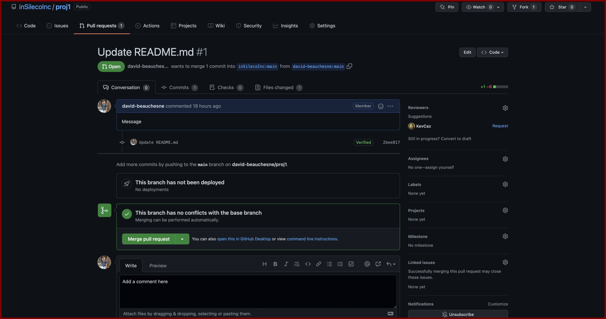
```

---
# Pull requests 

## Review process

- Go to *Files changed* to visualize proposed changes in the pull request

```{r echo=FALSE, out.width="80%"}
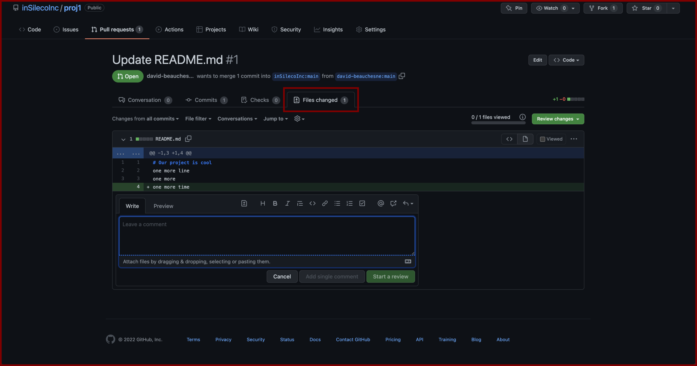
```

---
# Pull requests 

## Review process

- Review changes, add comments, commit changes of your own

```{r echo=FALSE, out.width="80%"}

```

---
# Pull requests 

## Review process

- Click *Review changes* and add a general comment describing your feedback

```{r echo=FALSE, out.width="80%"}
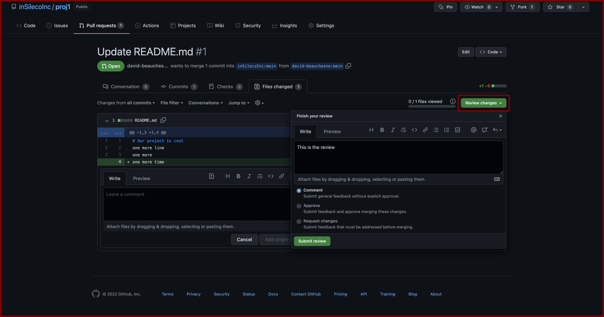
```

---
# Pull requests 

## Review process

- You can comment, approve or request improvements

```{r echo=FALSE, out.width="80%"}
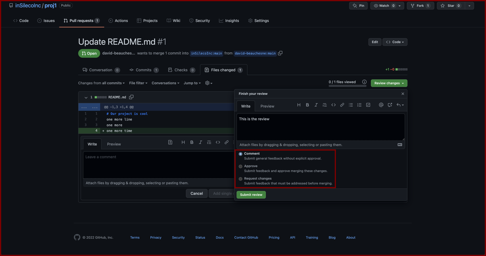
```

---
# Pull requests 

## Review process

- When done, click *submit review*

```{r echo=FALSE, out.width="80%"}
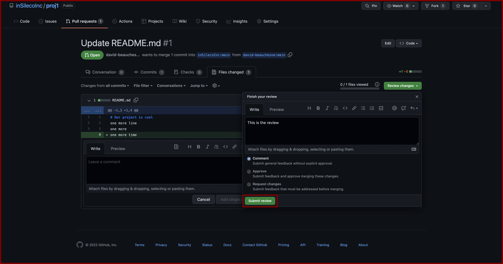
```


---
# Pull requests 

## Review process 

- Once completed, merge and close pull request

```{r echo=FALSE, out.width="80%"}
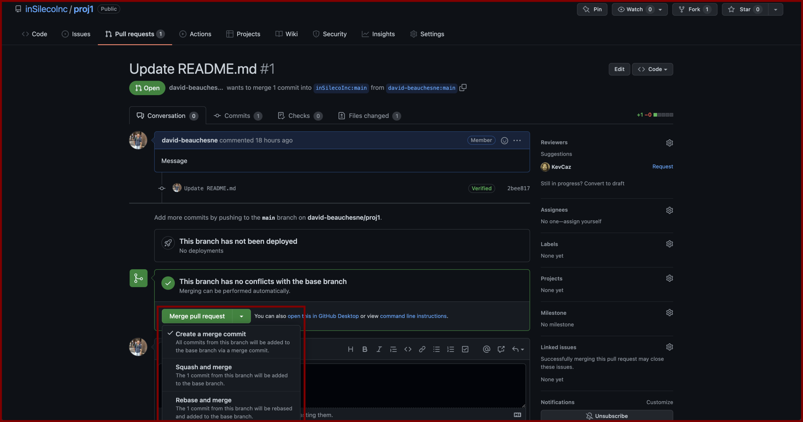
```

.font80[`r nf()` Can be an interative process, think peer-review!]

---
# `r lc()` Let's do this

## Create a branch 

## Make a change 

## Create a pull request

## Asign pull request