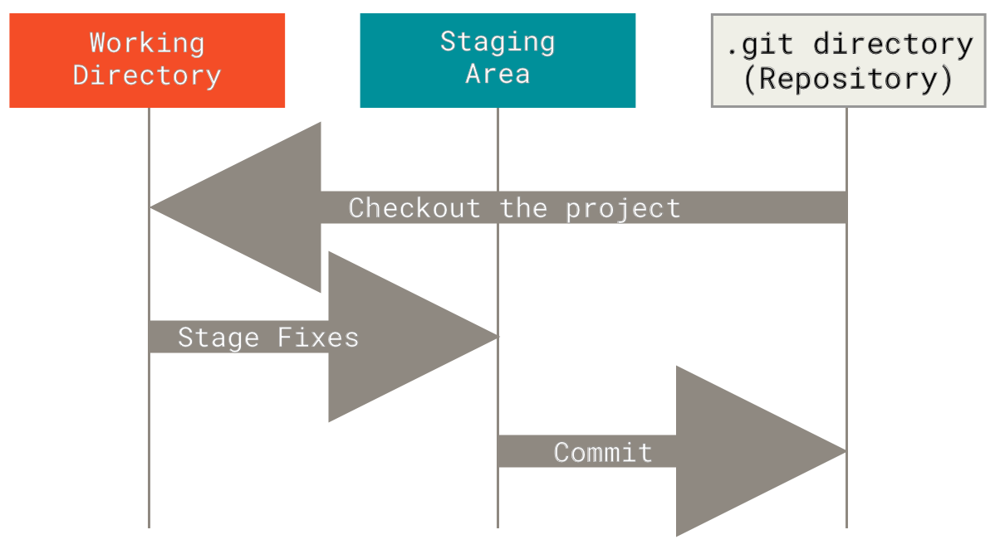

https://rdatatoolbox.github.io/instructions.html

==> ask what OS do they use 
==> ask if they are confortable with command line tools  
==> ask if they are using Rstudio or other IDE 

## command line or not..

## at first git may not be easy it is a very strong tool but need to understand how it works, not in details but in some depths

Un important changement pour pas mal de developement 

## 

## Build as history

## Manipulate the last commit 

## Work on history

# GitHub

https://github.blog/2021-11-16-the-2021-state-of-the-octoverse/

https://towardsdatascience.com/githubs-path-to-128m-public-repositories-f6f656ab56b1

https://github.blog/2018-11-08-100m-repos/

https://www.upguard.com/blog/bitbucket-vs-github

https://en.wikipedia.org/wiki/Timeline_of_GitHub

https://www.git-tower.com/mac?utm_source=learn-website&utm_campaign=git-faq&utm_medium=easy-in-tower&utm_content=undo-last-commit

### Best practices 

## Rewrite the history

`git rebase -i`

- https://learngitbranching.js.org/
https://docs.github.com/en/repositories/working-with-files/managing-large-files/about-git-large-file-storage

avoid large file there are alternative options 
https://git-lfs.github.com/

- https://git-lfs.github.com/
- https://docs.github.com/en/repositories/working-with-files/managing-large-files/about-large-files-on-github

## Adance gh gh cli 

<!-- 
."Capitalized, short (50 chars or less) summary

More detailed explanatory text, if necessary.  Wrap it to about 72
characters or so.  In some contexts, the first line is treated as the
subject of an email and the rest of the text as the body.  The blank
line separating the summary from the body is critical (unless you omit
the body entirely); tools like rebase will confuse you if you run the
two together.

Write your commit message in the imperative: "Fix bug" and not "Fixed bug"
or "Fixes bug."  This convention matches up with commit messages generated
by commands like git merge and git revert.

Further paragraphs come after blank lines.

- Bullet points are okay, too

- Typically a hyphen or asterisk is used for the bullet, followed by a
  single space, with blank lines in between, but conventions vary here

- Use a hanging indent"

https://tbaggery.com/2008/04/19/a-note-about-git-commit-messages.html

 As a general rule, your messages should start with a single line that’s no more than about 50 characters and that describes the changeset concisely, followed by a blank lin
  followed by a blank line, followed by a more detailed explanation. 
 
 
could be useful but takes chracters
 
 https://git-send-email.io/#step-1
 
 https://docs.ropensci.org/gert/
  -->

  ---
  # Three states

  > Git has three main states that your files can reside in: *modified*, *staged*, and *committed*.

  .center[]

  - `r lk()` S. Chacon & B. Straub (2014), [Pro Git](https://git-scm.com/book/en/v2).
